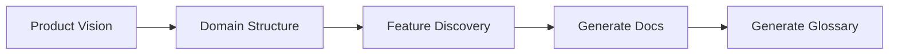

# Define Product

> **TL;DR:** Define a new product through Socratic Q&A and generate product docs

## Overview

The `/festina-define-product` skill is for new products that don't have code yet. Through Socratic Q&A, it captures the product's purpose, target users, key capabilities, and features, then generates structured product documentation organized by domain.

**Why it exists:** Start with clear product documentation before writing code, so AI-assisted development has context from day one.

**Summary:** Product definition before implementation — documentation-first approach.

## How It Works

1. **Product vision** — name, purpose, target users
2. **Domain structure** — organize features into bounded contexts
3. **Feature discovery** — Q&A for each feature (purpose, workflow, boundaries)
4. **Generate docs** — overview.md, domain indexes, feature docs
5. **Generate glossary** — project terminology with aliases

**Summary:** From vision to structured documentation through guided conversation.

## Boundaries

What this skill does NOT do:

- **Does NOT:** Analyze existing code → See [map-product](./map-product.md)
- **Does NOT:** Create engineering docs → See [map-engineering](./map-engineering.md)
- **Does NOT:** Create task files

## Interactions

- **Product Docs**: Creates overview.md, domain indexes, and feature docs
- **Glossary**: Generates `.festinalente/glossary.yaml`

## Limitations

- Best for greenfield products without existing code
- Requires user input for all product knowledge (no code analysis)
