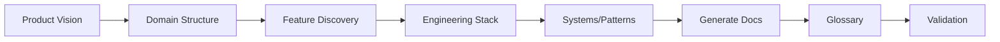

# Define Product & Engineering

> **TL;DR:** Define a new product and its engineering foundation through Socratic Q&A, generating both product and engineering docs

## Overview

The `/festina-define` skill is for greenfield projects that don't have code yet. Through Socratic Q&A, it captures the product's purpose, target users, key capabilities, and features, then moves into engineering concerns — tech stack, system architecture, patterns, and conventions. It generates structured product and engineering documentation, a shared glossary, and validates everything before finishing.

**Why it exists:** Start with clear product and engineering context before writing code, so AI-assisted development has both domain knowledge and technical guidance from day one.

**Summary:** Product and engineering definition before implementation — documentation-first approach for greenfield projects.

## How It Works

1. **Product vision** — name, purpose, target users
2. **Domain structure** — organize features into bounded contexts
3. **Feature discovery** — Q&A for each feature (purpose, workflow, boundaries)
4. **Engineering stack** — tech stack decisions, runtime, frameworks
5. **Systems and patterns** — architecture, system boundaries, design patterns, conventions
6. **Generate docs** — product docs (overview, domain indexes, feature docs) and engineering docs (overview, systems, patterns, conventions)
7. **Glossary** — project terminology with aliases in glossary.yaml
8. **Validation** — check references, orphans, missing fields across all generated docs

**Summary:** From vision through engineering decisions to validated documentation through guided conversation.

## Boundaries

What this skill does NOT do:

- **Does NOT:** Analyze existing code → See [map-product](./map-product.md) and [map-engineering](./map-engineering.md)
- **Does NOT:** Create task files
- **Does NOT:** Work with brownfield/existing codebases

## Interactions

- **Product Docs**: Creates overview.md, domain indexes, and feature docs
- **Engineering Docs**: Creates overview.md, system docs, pattern docs, and convention docs
- **Glossary**: Generates `.festinalente/glossary.yaml`
- **Finalize**: Intent sections in generated docs are rewritten to Overview/How It Works after implementation

## Limitations

- Best for greenfield projects without existing code
- Requires user input for all product and engineering knowledge (no code analysis)
- Very large projects may risk context window limits during a single session
