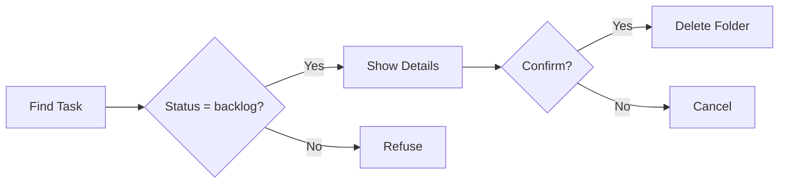

# Delete Task

> **TL;DR:** Permanently remove a backlog task and all its files

## Overview

The `/festina-delete` skill permanently removes a task from the board. It only works for tasks in `backlog` status — tasks that have progressed to scoped, planned, or later stages contain work that should not be casually discarded.

**Why it exists:** Clean up tasks that are no longer relevant before they accumulate.

**Summary:** Safe task removal with status guards and confirmation.

## How It Works



1. **Find task** by ID (or list backlog tasks to choose from)
2. **Validate status** — must be `backlog`
3. **Show details** — ID, title, description
4. **Confirm** — explicit user confirmation required
5. **Delete** — removes entire task folder via CLI

**Summary:** Status check, confirm, delete.

## Examples

### Delete a Backlog Task

```
/festina-delete 005

Task details:
- ID: 005
- Title: Fix typo in README
- Status: backlog

Are you sure? > Yes, delete

Task 005 deleted successfully.
```

### Refused: Task Not in Backlog

```
/festina-delete 003

Error: Cannot delete task in in-progress status.
Only tasks in Backlog status can be deleted.
```

## Boundaries

What this skill does NOT do:

- **Does NOT:** Delete tasks in scoped, planned, in-progress, finalize, or done status
- **Does NOT:** Archive tasks (deletion is permanent)
- **Does NOT:** Delete without user confirmation

## Limitations

- Deletion is permanent — no undo
- Only backlog tasks are eligible
