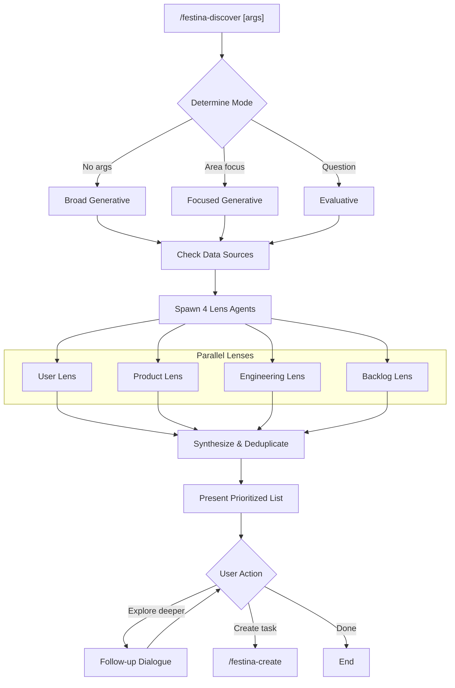

# Discover Opportunities

> **TL;DR:** Systematically surface feature opportunities through multi-perspective lens agents

## Overview

The `/festina-discover` skill is the entry point of the festinalente pipeline. It systematically surfaces feature opportunities, gaps, and improvements by analyzing the product from multiple perspectives using parallel lens agents. It handles both generative ("find opportunities") and evaluative ("is X worth doing?") use cases.

**Why it exists:** Ad-hoc prompting misses opportunities that systematic multi-perspective analysis catches. Discover uses data already in the system (product docs, engineering docs, tasks, codebase) to surface what's worth building next.

**Summary:** Discover surfaces what to build; create/scope/plan/implement builds it.

## How It Works



### Three Modes

| Mode | Trigger | Behavior |
|------|---------|----------|
| **Broad generative** | No arguments | Scans all data sources, surfaces everything |
| **Focused generative** | Area argument (e.g., "opportunities in CLI") | Narrows all lenses to specified area |
| **Evaluative** | Question argument (e.g., "is X worth doing?") | Analyzes specific idea, provides verdict with evidence |

### The Four Lenses

| Lens | Data Sources | Finds |
|------|-------------|-------|
| **User** | Product docs, feature docs, _index files | User journey gaps, friction points, undocumented flows |
| **Product** | Product docs + codebase | Undocumented features, stale docs, TODO/FIXME/HACK |
| **Engineering** | Engineering docs + codebase | Undocumented patterns, tech debt, churn hotspots |
| **Backlog** | All tasks across statuses | Recurring themes, stale items, done task ripple effects |

Each lens runs as a parallel Explore agent. Lenses gracefully skip when their data source is unavailable.

**Summary:** Four perspectives catch what any single viewpoint would miss.

### Opportunity Format

Each discovered opportunity includes:

- **Title** — Clear, actionable description
- **Perspective** — Which lens(es) found it
- **Evidence** — Specific references (file:line, doc IDs, task IDs)
- **Problem** — What's wrong or missing
- **Confidence** — high / medium / low
- **Next action** — /festina-create or deeper exploration

When multiple lenses find the same issue, confidence increases.

## Examples

### Broad Discovery

```
/festina-discover

Checking data sources...
- Product docs: 24 docs found
- Engineering docs: 8 docs found
- Tasks: 15 tasks found
- Codebase: available

Spawning 4 lens agents in parallel...

[After synthesis]

## Discovered Opportunities

### High Confidence

1. **Standardize error handling across CLI scripts**
   Perspective: Engineering + Product
   Evidence: 6 different error patterns found in scripts/,
   engineering doc patterns/error-handling exists but isn't followed
   Problem: Inconsistent error messages, some swallow errors silently
   → /festina-create or explore deeper?

### Medium Confidence

2. **Add missing product docs for directive system**
   ...

What would you like to do?
[1] Explore "Standardize error handling" deeper
[2] Explore "Add missing product docs" deeper
[3] Create task from an opportunity
```

### Evaluative Mode

```
/festina-discover is adding a caching layer for CLI scripts worth it?

Mode: Evaluative — analyzing whether caching is worthwhile

[Spawns focused agents]

## Evaluation: CLI Script Caching

**Verdict:** Probably not worth it

**Evidence for:**
- 3 scripts read the same config file repeatedly
- list-tasks re-scans .festinalente/tasks/ on every call

**Evidence against:**
- Scripts run in <100ms currently (measured via git log timing)
- No user complaints about performance
- Caching adds complexity (invalidation, staleness)

**Recommendation:** Monitor performance first. If scripts exceed 500ms,
revisit with specific bottleneck data.

Would you like to explore this further or move on?
```

## Boundaries

What this skill does NOT do:

- **Does NOT:** Create files — output is conversational only
- **Does NOT:** Create tasks automatically — user must explicitly choose
- **Does NOT:** Cache results — every run produces fresh analysis
- **Does NOT:** Replace domain expertise — surfaces data for human judgment

## Interactions

- **Create skill**: Can invoke `/festina-create` with full opportunity context when user is ready
- **Product/Engineering docs**: Reads both for lens analysis
- **Tasks**: Reads all tasks for backlog lens analysis
- **Codebase**: Greps for patterns, TODOs, and analyzes git log churn

## Limitations

- Read-only analysis (no code or doc modifications)
- Quality of results depends on existing documentation coverage
- Lenses skip gracefully when data sources are missing
- Agent-based analysis may occasionally surface false positives
