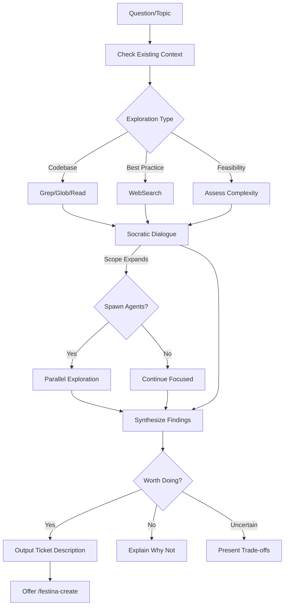

# Explore Questions and Ideas

> **TL;DR:** Explore questions through Socratic dialogue, research, and optionally create tasks

## Overview

The `/festina-explore` skill is for exploring questions, ideas, or topics before committing to action. It uses Socratic dialogue to probe assumptions and surface unknowns, researches the codebase and documentation, and determines whether something is worth pursuing as a task.

**Why it exists:** To think before acting - explore feasibility, understand patterns, and make informed decisions about what to build.

**Summary:** Explore validates ideas; create/scope/plan/implement builds them.

## How It Works



### Exploration Types

| Question Type | Actions | Output |
|---------------|---------|--------|
| **Codebase patterns** | Grep/Glob/Read relevant code | Pattern analysis |
| **Feasibility** | Search for related functionality, assess complexity | Go/no-go recommendation |
| **Best practices** | WebSearch, compare to current state | Recommendations with sources |
| **Comparison** | Analyze both options, trade-offs | Decision matrix |

### Socratic Dialogue

Throughout exploration:

- Ask clarifying questions to understand scope
- Probe assumptions: "What specifically triggers that?"
- Surface unknowns: "Have you considered...?"
- Validate findings: "Does this match your understanding?"

**Summary:** Dialogue ensures exploration targets the real question.

### Agent Escalation

When scope expands beyond focused exploration:

```
This looks broader than expected. Want me to spawn agents for a deeper exploration?

[Go deep] Spawn parallel agents for thorough exploration
[Stay focused] Keep it narrow, I'll ask follow-ups
```

If user selects "Go deep", spawns up to 3 parallel agents:
- **Codebase Explorer**: Find files, patterns, implementations
- **Doc Researcher**: Analyze product and engineering docs
- **Web Researcher**: Find external best practices

**Summary:** Agents enable deeper exploration without losing context.

## Examples

### Feasibility Check

```
/festina-explore Is our error handling consistent?

Exploring: Error handling consistency

Let me check existing context first...

Related engineering docs: patterns/error-handling (score: 0.8)

[Reads pattern doc]

I see we have a documented pattern. Let me check if it's followed...

[Grep for try/catch patterns, error classes]

Found inconsistencies:
- apps/festinalente/src/scripts/ uses try/catch with console.error
- apps/vscode/src/ uses custom ErrorHandler class
- Some files throw raw strings, others use Error objects

This seems worth standardizing. Is there anything specific you want
me to dig into?

> That's enough

---

## Ticket: Standardize error handling across codebase

**Problem:** Error handling is inconsistent...
**Value:** Easier debugging, consistent error messages...
**Acceptance Criteria (suggested):** ...

---

What would you like to do?
[Create task] Invoke /festina-create with this ticket
[Keep exploring] Continue discussing
```

### Not Worth Pursuing

```
/festina-explore Should we add TypeScript strict mode?

Exploring: TypeScript strict mode

Let me check current config...

[Reads tsconfig.json files]

Strict mode is already enabled:
- strict: true
- noImplicitAny: true
- strictNullChecks: true

---

## Exploration Conclusion

**Question:** Should we add TypeScript strict mode?

**Finding:** This doesn't warrant a task because:
- Strict mode is already enabled in tsconfig.json
- All strict flags are active
```

**Summary:** Exploration prevents unnecessary work.

## Boundaries

What this skill does NOT do:

- **Does NOT:** Automatically create tasks - outputs ticket description for user decision
- **Does NOT:** Skip checking existing context (docs, tasks)
- **Does NOT:** Make changes to the codebase
- **Does NOT:** Replace the create skill - it leads into create when appropriate

## Ticket Output Format

When exploration concludes something is worth doing:

```markdown
## Ticket: {suggested title}

**Problem:** {what problem this would solve}

**Value:** {why it's worth solving}

**Context:** {what the exploration found}
- {finding 1}
- {finding 2}

**Acceptance Criteria (suggested):**
- Given {precondition}, when {action}, then {outcome}

**Related:**
- Product docs: {ids}
- Engineering docs: {ids}
- Existing tasks: {ids}
```

## Interactions

- **Create skill**: Can invoke `/festina-create` if user approves ticket
- **Product/Engineering docs**: Searches both for existing context
- **Web tools**: Uses WebSearch/WebFetch for best practices research

## Limitations

- Read-only exploration (no code modifications)
- Requires user decision to create tasks
- Agent escalation requires explicit user approval
