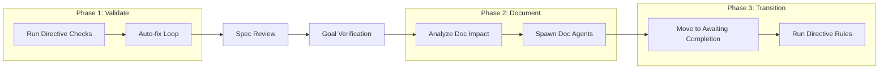

# Finalize Task

> **TL;DR:** Validate, document, and move a task to awaiting-completion

## Overview

The `/festina-finalize` skill is a three-phase orchestrator that moves a task through quality gates: validate implementation, update documentation, then transition to awaiting-completion. It's resumable - you can stop and restart from any phase. Git operations (committing, PR creation) are handled by directives — the skill itself is git-agnostic. Task closure (marking done) is handled separately by `/festina-complete`.

**Why it exists:** To ensure code quality and documentation before task closure.

**Summary:** Finalize is the quality gate between implementation and awaiting-completion.

## How It Works



### Phase 1: Validate

1. **Verify plan completion** - All tasks marked complete
2. **Run directive checks** - TypeScript, tests, linting
3. **Auto-fix loop** - Fix issues, log to iterations, retry
4. **Spec compliance review** - Independent agent verifies implementation against spec
5. **Goal-backward verification** - Translates acceptance criteria to observable behaviors, interactively verifies with user (YES/NO/DIFFERENT), spawns diagnostic subagent for failures. Optional directive-driven stub detection scans modified files.

### Phase 2: Documentation

1. **Search for unlisted impacts** - Autonomously scans for docs affected by the implementation but not listed in `affects`/`engineering`; auto-adds docs with relevance score >= 0.3 to task.xml without user confirmation
2. **Analyze impact** - Categorize docs as complete/update/create
3. **Pre-load context** - Smart context for doc agents
4. **Spawn parallel agents** - Product and/or Engineering doc agents, which maintain bidirectional `references`/`uses` fields across affected docs
5. **Validate outputs** - Check agent results
6. **Update glossary/indexes** - Orchestrator handles these

### Phase 3: Transition

1. **Move to awaiting-completion** - Update task status
2. **Run directive rules** - Git commit, push, PR creation (directive-driven)

**Summary:** Three distinct phases, each resumable independently. Phase 1 includes spec compliance review and goal-backward verification after directive checks. Git operations (committing, PR creation) are handled by directives, not the skill itself. Task closure is handled by `/festina-complete`.

## Examples

### Full Flow

```
/festina-finalize 001

━━━━━━━━━━━━━━━━━━━━━━━━━━━━━━━
PHASE 1: VALIDATE AND COMMIT
━━━━━━━━━━━━━━━━━━━━━━━━━━━━━━━

Running check: TypeScript...
PASS: TypeScript

All checks passed!

━━━━━━━━━━━━━━━━━━━━━━━━━━━━━━━
PHASE 2: DOCUMENTATION
━━━━━━━━━━━━━━━━━━━━━━━━━━━━━━━

Product Docs: Will COMPLETE auth/login
Spawning agents...
✓ Product Docs Agent completed

━━━━━━━━━━━━━━━━━━━━━━━━━━━━━━━
PHASE 3: TRANSITION
━━━━━━━━━━━━━━━━━━━━━━━━━━━━━━━

Task 001 moved to Awaiting Completion!

Next: /festina-complete 001
```

### Directive Check Failure with Auto-Fix

```
/festina-finalize 002

━━━━━━━━━━━━━━━━━━━━━━━━━━━━━━━
PHASE 1: VALIDATE AND COMMIT
━━━━━━━━━━━━━━━━━━━━━━━━━━━━━━━

Running check: TypeScript...
PASS: TypeScript

Running check: Oxlint...
FAIL: Oxlint
  src/handlers/auth.ts:23 — no-unused-vars: 'tempResult' is assigned but never used

Auto-fixing...
Removed unused variable 'tempResult'
Logged iteration: "auto-fix: removed unused variable"

Re-running check: Oxlint...
PASS: Oxlint

All checks passed!
```

### Goal Verification Failure

```
/festina-finalize 003

━━━━━━━━━━━━━━━━━━━━━━━━━━━━━━━
PHASE 1: VALIDATE AND COMMIT
━━━━━━━━━━━━━━━━━━━━━━━━━━━━━━━

All directive checks passed!

Goal-backward verification:
AC1: "Given valid credentials, When user submits login, Then session is created"
  Observable: POST /login returns 200 with session cookie
  Verified? > YES ✓

AC2: "Given expired session, When user makes request, Then 401 is returned"
  Observable: Request with expired token returns 401
  Verified? > DIFFERENT — currently returns 403

Spawning diagnostic agent for AC2...
Found: src/middleware/auth.ts:67 returns 403 for expired tokens
Suggested fix: Change status code from 403 to 401

Apply fix? > Yes

Re-verifying AC2... > YES ✓

All acceptance criteria verified.
```

**Summary:** Each phase shows clear progress and outputs. Failures are auto-fixed or resolved interactively.

## Boundaries

What this skill does NOT do:

- **Does NOT:** Write implementation code → See [implement](./implement.md)
- **Does NOT:** Close tasks (mark as done) → See [complete](./complete.md)
- **Does NOT:** Handle git operations directly (committing, PR creation are directive-driven)

## Interactions

- **Directives**: Runs all configured checks in Phase 1; git/PR operations in Phase 3 are directive-driven
- **Complete**: After finalize, run `/festina-complete` to close the task
- **Spec Review**: Independent Explore agent verifies implementation against spec requirements
- **Goal Verification**: Translates acceptance criteria to testable behaviors and verifies interactively with the user
- **Product Docs**: Spawns agent if task has `affects` field
- **Engineering Docs**: Spawns agent if task has `engineering` field
- **Bidirectional References**: Doc agents maintain `references`/`uses` fields to keep cross-doc relationships consistent
- **Glossary**: Updates with new terms from doc agents

## Limitations

- Task should be in `finalize` status
- Moves to `awaiting-completion`, not `done` — run `/festina-complete` to close
- Git-related requirements (branch verification, clean working tree) are enforced by directives, not the skill
