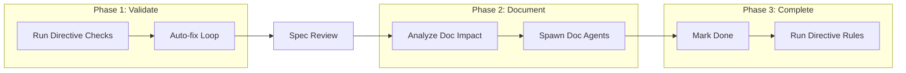

# Finalize Task

> **TL;DR:** Validate, document, and complete a task in three phases

## Overview

The `/festina-finalize` skill is a three-phase orchestrator that completes a task: validate implementation, update documentation, then mark the task as done. It's resumable - you can stop and restart from any phase. Git operations (committing, merging, branch cleanup) are handled by the `git.xml` directive if mapped — the skill itself is git-agnostic.

**Why it exists:** To ensure code quality and documentation before completion.

**Summary:** Finalize is the quality gate between implementation and done.

## How It Works



### Phase 1: Validate

1. **Verify plan completion** - All tasks marked complete
2. **Run directive checks** - TypeScript, tests, linting
3. **Auto-fix loop** - Fix issues, log to iterations, retry
4. **Spec compliance review** - Independent agent verifies implementation against spec

### Phase 2: Documentation

1. **Analyze impact** - Categorize docs as complete/update/create
2. **Pre-load context** - Smart context for doc agents
3. **Spawn parallel agents** - Product and/or Engineering doc agents
4. **Validate outputs** - Check agent results
5. **Update glossary/indexes** - Orchestrator handles these

### Phase 3: Complete

1. **Mark done** - Update task status
2. **Run directive rules** - Git operations, PR creation, etc. (directive-driven)

**Summary:** Three distinct phases, each resumable independently. Phase 1 includes an independent spec compliance review after directive checks. Git operations (committing, merging, branch cleanup) are handled by directives, not the skill itself.

## Examples

### Full Flow

```
/festina-finalize 001

━━━━━━━━━━━━━━━━━━━━━━━━━━━━━━━
PHASE 1: VALIDATE AND COMMIT
━━━━━━━━━━━━━━━━━━━━━━━━━━━━━━━

Running check: TypeScript...
PASS: TypeScript

All checks passed!

━━━━━━━━━━━━━━━━━━━━━━━━━━━━━━━
PHASE 2: DOCUMENTATION
━━━━━━━━━━━━━━━━━━━━━━━━━━━━━━━

Product Docs: Will COMPLETE auth/login
Spawning agents...
✓ Product Docs Agent completed

━━━━━━━━━━━━━━━━━━━━━━━━━━━━━━━
PHASE 3: COMPLETE
━━━━━━━━━━━━━━━━━━━━━━━━━━━━━━━

Task 001 completed!
```

**Summary:** Each phase shows clear progress and outputs.

## Boundaries

What this skill does NOT do:

- **Does NOT:** Write implementation code → See [implement](./implement.md)
- **Does NOT:** Handle git operations directly (branching, committing, merging are directive-driven)
- **Does NOT:** Create PRs directly (use a directive like `github.xml` for PR workflows)

## Interactions

- **Directives**: Runs all configured checks in Phase 1; git/PR operations in Phase 3 are directive-driven
- **Spec Review**: Independent Explore agent verifies implementation against spec requirements
- **Product Docs**: Spawns agent if task has `affects` field
- **Engineering Docs**: Spawns agent if task has `engineering` field
- **Glossary**: Updates with new terms from doc agents

## Limitations

- Task should be in `finalize` status
- Git-related requirements (branch verification, clean working tree) are enforced by the `git.xml` directive, not the skill
