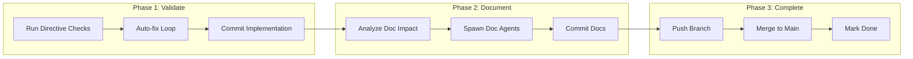

# Finalize Task

> **TL;DR:** Validate, commit, document, and complete a task in three phases

## Overview

The `/festina-finalize` skill is a three-phase orchestrator that completes a task: validate and commit implementation, update documentation, then merge to main. It's resumable - you can stop and restart from any phase.

**Why it exists:** To ensure code quality, documentation, and clean git history before completion.

**Summary:** Finalize is the quality gate between implementation and done.

## How It Works



### Phase 1: Validate and Commit

1. **Verify plan completion** - All tasks marked complete
2. **Run directive checks** - TypeScript, tests, linting
3. **Auto-fix loop** - Fix issues, log to iterations, retry
4. **Determine commit type** - feat/fix/refactor/docs from labels
5. **Commit implementation** - `{type}({id}): {title}`

### Phase 2: Documentation

1. **Analyze impact** - Categorize docs as complete/update/create
2. **Pre-load context** - Smart context for doc agents
3. **Spawn parallel agents** - Product and/or Engineering doc agents
4. **Validate outputs** - Check agent results
5. **Update glossary/indexes** - Orchestrator handles these
6. **Commit docs** - `docs({id}): product|engineering`

### Phase 3: Complete

1. **Push branch** - To remote
2. **Confirm merge** - User approval
3. **Mark done** - Update task status
4. **Merge** - No-ff merge preserves history
5. **Cleanup** - Delete task branch

**Summary:** Three distinct phases, each resumable independently.

## Examples

### Full Flow

```
/festina-finalize 001

━━━━━━━━━━━━━━━━━━━━━━━━━━━━━━━
PHASE 1: VALIDATE AND COMMIT
━━━━━━━━━━━━━━━━━━━━━━━━━━━━━━━

Running check: TypeScript...
PASS: TypeScript

Commit: e5f6g7h feat(001): Add user authentication

━━━━━━━━━━━━━━━━━━━━━━━━━━━━━━━
PHASE 2: DOCUMENTATION
━━━━━━━━━━━━━━━━━━━━━━━━━━━━━━━

Product Docs: Will COMPLETE auth/login
Spawning agents...
✓ Product Docs Agent completed

Commit: h8i9j0k docs(001): product - complete login

━━━━━━━━━━━━━━━━━━━━━━━━━━━━━━━
PHASE 3: COMPLETE
━━━━━━━━━━━━━━━━━━━━━━━━━━━━━━━

Merge to main? > Yes
Branch merged successfully!

Task 001 completed!
```

**Summary:** Each phase shows clear progress and outputs.

## Boundaries

What this skill does NOT do:

- **Does NOT:** Write implementation code → See [implement](./implement.md)
- **Does NOT:** Create PRs (unless directive overrides merge behavior)

## Configuration

| Setting | Description | Default |
|---------|-------------|---------|
| Commit types | Valid conventional commit types | feat, fix, refactor, docs |
| Merge method | How to merge branches | --no-ff |

## Interactions

- **Directives**: Runs all configured checks in Phase 1
- **Product Docs**: Spawns agent if task has `affects` field
- **Engineering Docs**: Spawns agent if task has `engineering` field
- **Glossary**: Updates with new terms from doc agents

## Limitations

- Must be on task branch
- Task should be in `finalize` status
- Working tree must be clean for merge
