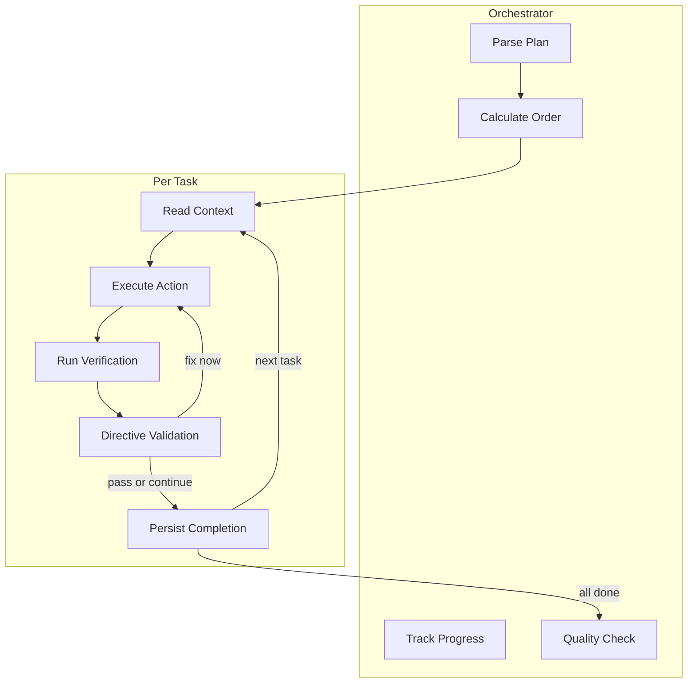

# Implement Task

> **TL;DR:** Execute plan tasks directly with progress persistence and quality verification

## Overview

The `/festina-implement` skill executes the plan by running each task directly in the orchestrator context. Progress is persisted immediately after each task completes, enabling resume if interrupted.

**Why it exists:** To execute complex plans reliably with verification at each step.

**Summary:** Implement executes tasks directly through the plan, persisting progress as it goes.

## How It Works



### Direct Execution

Each plan task is executed directly by the orchestrator:

1. **Read context** files listed in the task's context element, plus pattern reference if specified
2. **Execute action** directly using available tools (Read, Edit, Write, Bash), respecting spec boundaries and contracts from context
3. **Run verification** command and check result
4. **Per-task directive validation** - Run directive validation checks (commands, patterns, checklists) scoped to the current task's files. Violations prompt user with Fix now / Continue anyway
5. **Persist immediately** - Mark `completed="true"` in plan.xml
6. **Continue** to next task or handle failure

**Summary:** Direct execution gives the orchestrator full visibility of prior task changes, enabling cross-task coherence.

### Progress Persistence

After each task completes:

```xml
<task id="1" type="auto" completed="true" completed_at="2026-03-01T12:00:00Z">
  ...
</task>
```

This enables:
- **Resume** - Continue from where you left off
- **Visibility** - See which tasks are done (also shown as a progress indicator in the sidebar kanban TreeView)
- **Audit** - Track when each step completed

### Quality Verification

After all tasks complete, orchestrator runs:

1. **Anti-pattern scan** - Find TODO, FIXME, HACK markers
2. **Requirement trace** - Verify each FR has implementation
3. **Wiring verification** - Ensure new files are imported

**Summary:** Quality checks catch incomplete work before finalize.

### Contract and Boundary Handling

When the spec contains `<contracts>` or `<boundaries>` elements, the implement skill extracts them during the spec-reading step. Because the orchestrator executes tasks directly, boundaries and contracts remain available in context throughout execution without any injection needed.

The orchestrator respects boundary rules (always/ask-first/never) and contract preconditions, postconditions, invariants, and properties directly as it executes each task. Contracts may also appear in the task's `<context>` element from the plan, providing additional visibility.

## Examples

### Full Implementation

```
/festina-implement 001

Reading plan: .festinalente/tasks/001/plan.xml
Found 3 tasks, 0 completed, order: 1, 2, 3

━━━━━━━━━━━━━━━━━━━━━━━━━━━━━━━━━━━
[1/3] Create auth routes file
━━━━━━━━━━━━━━━━━━━━━━━━━━━━━━━━━━━
✓ Task 1 completed: Created src/routes/auth.ts

━━━━━━━━━━━━━━━━━━━━━━━━━━━━━━━━━━━
[2/3] Add login endpoint
━━━━━━━━━━━━━━━━━━━━━━━━━━━━━━━━━━━
✓ Task 2 completed: Added POST /login handler

All tasks complete. Moving to finalize.
Next: /festina-finalize 001
```

### Resume After Interruption

```
/festina-implement 002

Reading plan...
Found 5 tasks, 2 completed, order: 3, 4, 5

Resuming from task 3...
```

**Summary:** Implementation can be resumed at any point.

## Boundaries

What this skill does NOT do:

- **Does NOT:** Create the plan → See [plan](./plan.md)
- **Does NOT:** Handle git operations directly (directive-driven)
- **Does NOT:** Update documentation → See [finalize](./finalize.md)

## Interactions

- **Spec Boundaries**: If spec.xml contains `<boundaries>`, the always/ask-first/never rules are available in context during execution
- **Spec Contracts**: If spec.xml contains `<contracts>`, contracts are available in context during execution
- **Directives**: Applies `phase="implement"` rules. Directives are loaded once and remain in context. Per-task directive validation runs after each task completes, before marking the task complete

## Limitations

- Task must have plan.xml (status: planned or in-progress)
- Branch requirements (e.g., must be on task branch) are enforced by the `git.xml` directive, not the skill
