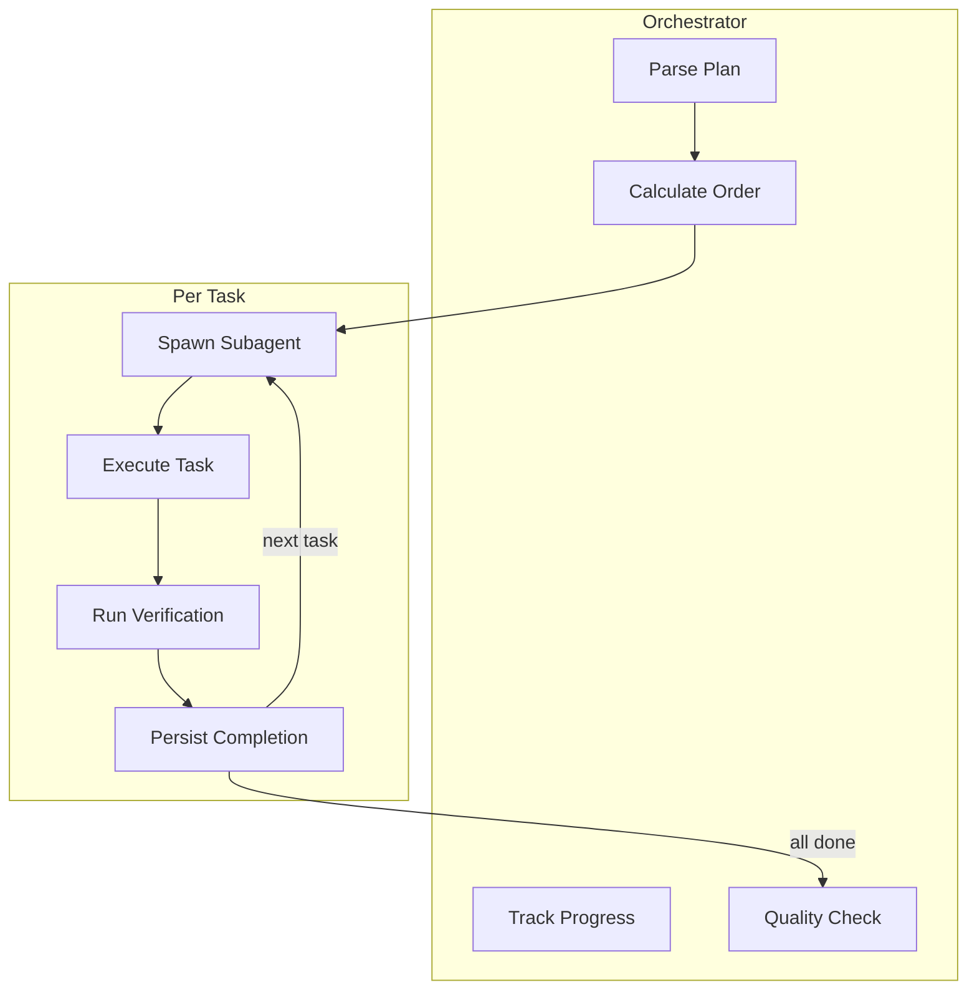

# Implement Task

> **TL;DR:** Execute plan tasks through subagent orchestration with progress persistence

## Overview

The `/festina-implement` skill executes the plan by spawning a fresh subagent for each task. Progress is persisted immediately after each task completes, enabling resume if interrupted.

**Why it exists:** To execute complex plans reliably with verification at each step.

**Summary:** Implement orchestrates subagents through the plan, persisting progress as it goes.

## How It Works



### Subagent Orchestration

Each plan task is executed by a fresh subagent:

1. **Build prompt** from task elements (files, pattern, action, verify)
2. **Spawn subagent** with general-purpose type
3. **Wait for completion** and parse SUCCESS/FAILURE
4. **Persist immediately** - Mark `completed="true"` in plan.xml
5. **Continue** to next task or handle failure

**Summary:** Fresh subagents ensure clean context for each implementation step.

### Progress Persistence

After each task completes:

```xml
<task id="1" type="auto" completed="true" completed_at="2026-03-01T12:00:00Z">
  ...
</task>
```

This enables:
- **Resume** - Continue from where you left off
- **Visibility** - See which tasks are done
- **Audit** - Track when each step completed

### Quality Verification

After all tasks complete, orchestrator runs:

1. **Anti-pattern scan** - Find TODO, FIXME, HACK markers
2. **Requirement trace** - Verify each FR has implementation
3. **Wiring verification** - Ensure new files are imported

**Summary:** Quality checks catch incomplete work before finalize.

## Examples

### Full Implementation

```
/festina-implement 001

Reading plan: .festinalente/tasks/001/plan.xml
Found 3 tasks, 0 completed, order: 1, 2, 3

━━━━━━━━━━━━━━━━━━━━━━━━━━━━━━━━━━━━━
[1/3] Create auth routes file
━━━━━━━━━━━━━━━━━━━━━━━━━━━━━━━━━━━━━
Spawning subagent...
✓ Task 1 completed: Created src/routes/auth.ts

━━━━━━━━━━━━━━━━━━━━━━━━━━━━━━━━━━━━━
[2/3] Add login endpoint
━━━━━━━━━━━━━━━━━━━━━━━━━━━━━━━━━━━━━
Spawning subagent...
✓ Task 2 completed: Added POST /login handler

All tasks complete. Moving to finalize.
Next: /festina-finalize 001
```

### Resume After Interruption

```
/festina-implement 002

Reading plan...
Found 5 tasks, 2 completed, order: 3, 4, 5

Resuming from task 3...
```

**Summary:** Implementation can be resumed at any point.

## Boundaries

What this skill does NOT do:

- **Does NOT:** Create the plan → See [plan](./plan.md)
- **Does NOT:** Handle git operations directly (directive-driven)
- **Does NOT:** Update documentation → See [finalize](./finalize.md)

## Configuration

| Setting | Description | Default |
|---------|-------------|---------|
| Subagent type | Agent type for tasks | general-purpose |

## Interactions

- **Smart Context**: Loads relevant docs via select-context
- **Doc Freshness**: Warns if affected docs are stale
- **Directives**: Applies `phase="implement"` rules

## Limitations

- Task must have plan.xml (status: planned or in-progress)
- Branch requirements (e.g., must be on task branch) are enforced by the `git.xml` directive, not the skill
