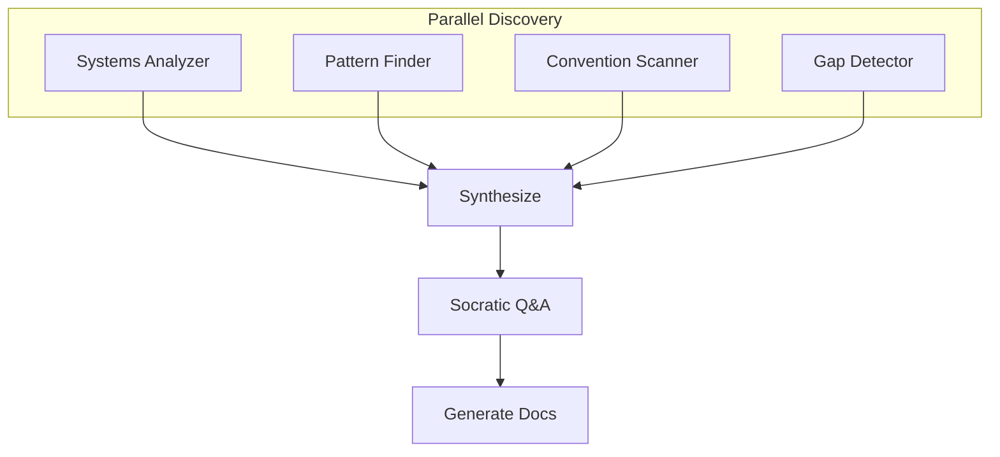

# Map Engineering

> **TL;DR:** Analyze codebase architecture with parallel agents and generate engineering docs

## Overview

The `/festina-map-engineering` skill creates engineering documentation for an existing codebase. Similar to map-product, it uses parallel exploration agents to discover systems architecture, code patterns, and project conventions, then validates findings through Socratic Q&A.

**Why it exists:** Engineering docs capture how things work technically — architecture decisions, patterns, and conventions that product docs don't cover.

**Summary:** Automated architecture discovery + human validation = engineering documentation.

## How It Works

1. **Parallel discovery** — agents scan for systems, patterns, and conventions
2. **Synthesize** — combine findings into a unified architecture view
3. **Socratic Q&A** — validate findings, capture tribal knowledge
4. **Generate docs** — systems, patterns, and conventions documentation

**Summary:** Discover architecture, validate with team, document for posterity.

## Boundaries

What this skill does NOT do:

- **Does NOT:** Create product docs → See [map-product](./map-product.md)
- **Does NOT:** Work without a codebase
- **Does NOT:** Skip user validation of findings

## Interactions

- **Engineering Docs**: Creates/updates systems, patterns, and conventions docs
- **CLI**: Uses `list-engineering` to check existing docs

## Limitations

- Requires codebase to exist
- Architecture discovery depends on code organization and naming
