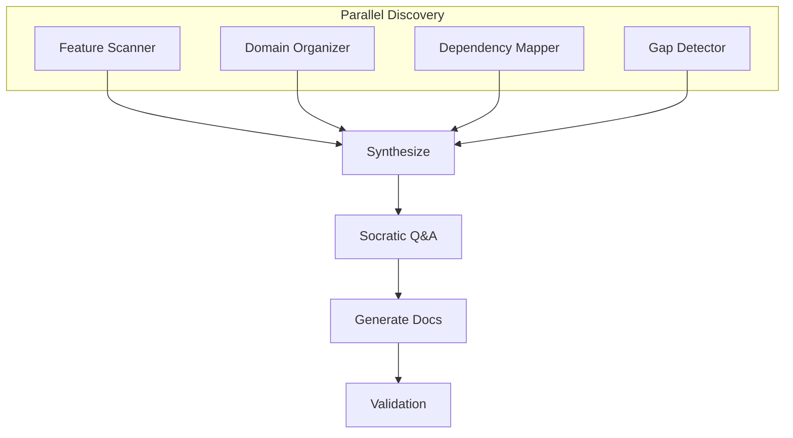

# Map Product

> **TL;DR:** Analyze existing codebase with parallel agents and generate product docs

## Overview

The `/festina-map-product` skill creates product documentation for an existing codebase. It launches 4 parallel exploration agents (Feature Scanner, Domain Organizer, Dependency Mapper, Gap Detector), synthesizes their findings, then walks through Socratic Q&A to validate and enrich the documentation.

**Why it exists:** Manually documenting an existing codebase is slow. Parallel agents discover features faster than sequential exploration.

**Summary:** Automated discovery + human validation = comprehensive product docs.

<!-- Tier 2 boundary: content above this line is loaded at standard tier -->

## How It Works

1. **Parallel discovery** — 4 agents scan simultaneously
2. **Synthesize** — combine findings, resolve conflicts
3. **Socratic Q&A** — validate features, gather user knowledge
4. **Generate docs** — overview, domain indexes, feature docs per domain
5. **Generate glossary** — project terminology
6. **Validation** — check references, orphans, missing fields

**Summary:** Discover, validate, document, verify.

## Boundaries

What this skill does NOT do:

- **Does NOT:** Create engineering docs → See [map-engineering](./map-engineering.md)
- **Does NOT:** Work without a codebase → See [create-project](./create-project.md) (greenfield flow)
- **Does NOT:** Skip user validation of findings

## Interactions

- **Product Docs**: Creates/updates overview.md, domain indexes, and feature docs
- **Glossary**: Generates `.festinalente/glossary.yaml`
- **Directives**: Loads and enforces mapped directives (e.g., git workflow rules)
- **CLI**: Uses `list-product` to check existing docs

## Limitations

- Requires codebase to exist (not for greenfield)
- Agent discovery quality depends on codebase structure and naming conventions
