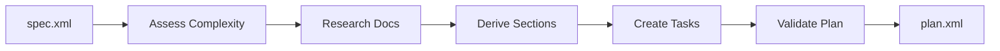

# Plan Task

> **TL;DR:** Transform functional specification into executable implementation steps

## Overview

The `/festina-plan` skill converts a functional specification into an actionable implementation plan. Each plan task is self-contained with enough context that implementing subagents don't need to re-read the spec.

**Why it exists:** To break complex work into verifiable atomic steps that can be executed reliably.

**Summary:** Plan creates the roadmap that implement will follow step by step.

## How It Works



### Complexity Assessment

Plans scale detail based on complexity:

| Criteria | Simple | Medium | Complex |
|----------|--------|--------|---------|
| Affected files | 1-2 | 3-5 | 6+ |
| Functional requirements | ≤3 | 4-6 | 7+ |
| New files created | 0 | 1-2 | 3+ |
| External dependencies | 0 | 0-1 | 2+ |

**Summary:** Higher complexity = more detailed plan tasks.

### Plan Task Structure

Each task in the plan includes:

```xml
<task id="1" type="auto" depends="">
  <name>Implementation step name</name>
  <files>path/to/file.ts (create|modify)</files>
  <requirements>FR1, FR2</requirements>
  <pattern>Pattern at file:line</pattern>
  <context>
    <file>path/to/read/first.ts</file>
  </context>
  <action>
    - Step by step instructions
    - With code snippets if helpful
  </action>
  <verify>npm run build</verify>
  <done>Observable outcome, not implementation detail</done>
</task>
```

### Validation Checks

Before saving, plans are validated for:

- **Requirement coverage** - Every FR has an addressing task
- **Dependency cycles** - No circular dependencies
- **Scope sanity** - Warning if >7 tasks
- **Done criteria quality** - Outcomes, not implementation details
- **Wiring check** - New files are imported somewhere

**Summary:** Validation catches plan issues before implementation begins.

## Examples

### Medium Complexity Plan

```
/festina-plan 001

Reading spec: .festinalente/tasks/001/spec.xml
- 4 functional requirements
- 3 files affected
- Complexity: medium

Creating implementation plan...

Plan created: .festinalente/tasks/001/plan.xml
- 4 implementation steps
- Testing strategy defined
- 3 edge cases identified

Task 001 moved to Planned
Next: /festina-implement 001
```

**Summary:** Plans include all context needed for implementation.

## Boundaries

What this skill does NOT do:

- **Does NOT:** Create the spec → See [scope](./scope.md)
- **Does NOT:** Execute implementation → See [implement](./implement.md)
- **Does NOT:** Modify code files

## Configuration

| Setting | Description | Default |
|---------|-------------|---------|
| Max tasks warning | Warn if plan exceeds | 7 tasks |

## Interactions

- **Product Docs**: Reads affected docs for implementation context
- **Engineering Docs**: Reads patterns to reference in plan tasks
- **Directives**: Uses verification commands from directives

## Limitations

- Must be on task branch (`task/{id}`)
- Task must have spec.xml (status: scoped)
