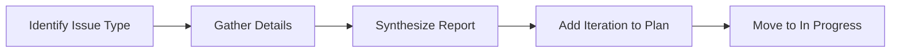

# Rework Task

> **TL;DR:** Return a task to in-progress with a structured issue report

## Overview

The `/festina-rework` skill handles the case when review finds issues after implementation. It gathers structured issue details through Q&A — type (bug, incomplete, design change, performance), severity, reproduction steps — then adds an iteration entry to the plan and moves the task back to in-progress. Works from both `finalize` and `awaiting-completion` columns.

**Why it exists:** Review feedback needs to be captured in a structured, actionable way so the next implementation cycle addresses it precisely.

**Summary:** Structured issue capture that feeds directly into the next implementation cycle.

<!-- Tier 2 boundary: content above this line is loaded at standard tier -->

## How It Works



1. **Issue type** — Bug, Incomplete, Design change, or Performance
2. **Severity** — Blocker, Major, or Minor
3. **Gather details** — Type-specific questions (actual/expected for bugs, missing items for incomplete, etc.)
4. **Synthesize** — Create structured report with actionable items
5. **Add iteration** — Append to plan's `<iterations>` section with pending actions
6. **Move task** — Status from `finalize` or `awaiting-completion` to `in-progress`

**Summary:** From review feedback to actionable iteration in the plan.

## Examples

### Bug Found During Review

```
/festina-rework 007

Issue type? > Bug
Severity? > Major

What's happening? > Login fails silently on wrong password
What should happen? > Show "Invalid credentials" error

Task 007 returned to In Progress
- Iteration: 2
- Actions: 3 items to address

Next: /festina-implement 007
```

## Boundaries

What this skill does NOT do:

- **Does NOT:** Fix the issue → See [implement](./implement.md)
- **Does NOT:** Work from statuses other than finalize or awaiting-completion (warns otherwise)
- **Does NOT:** Skip issue gathering

## Interactions

- **Plan File**: Adds `<iteration>` entry with issue details and pending actions
- **Directives**: Applies `phase="rework"` rules if configured

## Limitations

- Designed for tasks in `finalize` or `awaiting-completion` status (warns if different)
- Cannot capture multiple distinct issues in one rework (run again if needed)
