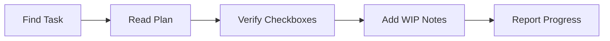

# Save Progress

> **TL;DR:** Persist partial implementation progress when interrupted

## Overview

The `/festina-save` skill captures your current implementation progress when you need to stop working. It verifies plan checkboxes match actual work done, adds WIP notes with continuation hints, and ensures the task stays in in-progress status so you can resume with `/festina-implement`.

**Why it exists:** Implementation can be interrupted. Save ensures no progress is lost and resumption is smooth.

**Summary:** Checkpoint your work with verified progress and resumption context.

## How It Works



1. **Find task** in in-progress status
2. **Read plan** and parse checkboxes
3. **Verify checkboxes** match actual implementation (update discrepancies)
4. **Add WIP notes** to plan with date, progress count, and continuation hints
5. **Report** completed/total steps and next action

**Summary:** Verify, persist, and hint for smooth resumption.

## Examples

### Mid-Implementation Save

```
/festina-save 001

Saving WIP for task 001 "Add user authentication"...
Progress: 2/5 items complete

Verifying checkboxes match actual progress...
- [x] Create auth routes file - verified
- [x] Add login endpoint - verified
- [ ] Add logout endpoint - not started

WIP saved!
Next step: Add logout endpoint
Resume with: /festina-implement 001
```

## Boundaries

What this skill does NOT do:

- **Does NOT:** Move the task to finalize → See [implement](./implement.md)
- **Does NOT:** Create git commits directly (directive-driven)
- **Does NOT:** Work on tasks not in in-progress status

## Interactions

- **Plan File**: Updates checkboxes and adds WIP Notes section
- **Directives**: Applies `phase="save"` rules if configured

## Limitations

- Only works for tasks in `in-progress` status
- Requires a plan.xml to track checkbox progress (warns if missing)
