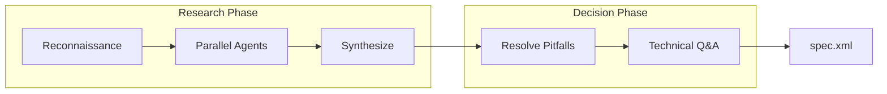

# Scope Task

> **TL;DR:** Research codebase and create functional specification through parallel exploration

## Overview

The `/festina-scope` skill transforms a backlog task into a scoped task with a functional specification. It researches the codebase using parallel exploration agents, identifies pitfalls, and captures technical decisions through Q&A.

**Why it exists:** To ensure implementation is informed by actual codebase patterns rather than assumptions.

**Summary:** Scope produces the technical blueprint that planning and implementation will follow.

## How It Works



### Research Depth Options

| Depth | When to Use | Agents Spawned |
|-------|-------------|----------------|
| Quick | Simple, well-understood changes | Sequential research |
| Deep | Complex or unfamiliar areas | 4 parallel agents |

### Parallel Research Agents

When using Deep research:

1. **Product Context Researcher** - Finds related product docs and constraints
2. **Pattern Finder** - Identifies engineering patterns to follow
3. **Codebase Analyzer** - Maps affected files and similar implementations
4. **Pitfall Detector** - Finds known issues and constraints

**Summary:** Agents run concurrently for faster, more thorough exploration.

### Pitfall Resolution

Pitfalls are categorized as:
- **Decision**: Multiple valid approaches - user chooses
- **FYI**: Standard mitigation - user is informed

```
Race conditions — Concurrent edits need conflict resolution.
How should we handle this?
[Use CRDTs] Automatic merge
[Last-write-wins] Simple, may lose edits
[Operational transform] Complex but preserves intent
> Use CRDTs
```

## Examples

### Quick Research Path

```
/festina-scope 001

How thorough should the research be?
> Quick

Researching (sequential)...
Found: src/components/Button.tsx, src/styles/mobile.css

Research Synthesis:
- Product Context: ui/buttons
- Engineering Patterns: responsive-pattern at breakpoints.ts:12
- Pitfalls (FYI): z-index stacking → Use lower value
```

### Deep Research Path

```
/festina-scope 002

How thorough should the research be?
> Deep

Launching parallel research agents...
[Product Context Researcher] Finding docs...
[Pattern Finder] Finding patterns...
[Codebase Analyzer] Analyzing structure...
[Pitfall Detector] Finding issues...

All agents complete. Synthesizing...

Decisions needed:
- Race conditions: How should we handle concurrent edits?
```

**Summary:** Deep research provides comprehensive coverage for complex tasks.

## Boundaries

What this skill does NOT do:

- **Does NOT:** Create task.xml → See [create](./create.md)
- **Does NOT:** Create implementation steps → See [plan](./plan.md)
- **Does NOT:** Modify code

## Configuration

| Setting | Description | Default |
|---------|-------------|---------|
| Research depth | Quick or Deep | User choice |
| Agent count | Number of parallel agents | 4 (Deep mode) |

## Interactions

- **Product Docs**: Reads docs listed in task's `affects` field
- **Engineering Docs**: Reads docs listed in task's `engineering` field
- **Directives**: Applies any `phase="scope"` rules

## Limitations

- Must be on main/master branch to create task branch
- Task must be in `backlog` status
