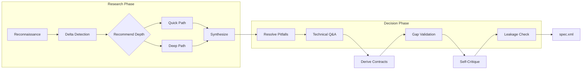

# Scope Task

> **TL;DR:** Research codebase and create functional specification through parallel exploration

## Overview

The `/festina-scope` skill transforms a backlog task into a scoped task with a functional specification. It detects brownfield changes against existing product docs, researches the codebase using parallel exploration agents, identifies pitfalls, captures technical decisions and autonomy boundaries through Q&A, and validates the resulting spec for gaps and implementation leakage.

**Why it exists:** To ensure implementation is informed by actual codebase patterns rather than assumptions, and to produce specs that are precise, conflict-free, and outcome-focused.

**Summary:** Scope produces the technical blueprint that planning and implementation will follow, including delta context for brownfield changes and autonomy boundaries for the implementation agent.

## How It Works



### Research Depth Options

Reconnaissance always runs first: it reads the affected product and engineering docs referenced by the task, identifies focus areas, and assesses observable signals (file count, module count, pattern clarity, cross-cutting concerns). After recon, the skill recommends Quick or Deep research based on those signals, and the user can accept or override the recommendation.

| Depth | When Recommended | Agents Spawned |
|-------|------------------|----------------|
| Quick | Few files (1-3), single module, clear patterns, no cross-cutting concerns | Sequential research |
| Deep | Many files (4+), multiple modules, unclear patterns, or cross-cutting concerns | 4 parallel agents |

### Parallel Research Agents

When using Deep research (after reconnaissance has already run):

1. **Product Context Researcher** - Finds related product docs and constraints
2. **Pattern Finder** - Identifies engineering patterns to follow
3. **Codebase Analyzer** - Maps affected files and similar implementations
4. **Pitfall Detector** - Finds known issues and constraints

**Summary:** Agents run concurrently for faster, more thorough exploration.

### Pitfall Resolution

Pitfalls are categorized as:
- **Decision**: Multiple valid approaches - user chooses
- **FYI**: Standard mitigation - user is informed

```
Race conditions — Concurrent edits need conflict resolution.
How should we handle this?
[Use CRDTs] Automatic merge
[Last-write-wins] Simple, may lose edits
[Operational transform] Complex but preserves intent
> Use CRDTs
```

### Brownfield Detection

When a task has an `affects` field referencing existing product docs, the scope skill detects this as a brownfield change. The user is offered a choice between a **delta spec format** and a full spec format before research begins.

The delta spec format documents three aspects of the change:
- **Current**: What exists today, drawn from the referenced product docs
- **Changing**: What this task modifies or adds
- **Unchanged**: What explicitly stays the same, providing clear boundaries for the implementation agent

This distinction prevents the implementation agent from accidentally rewriting or breaking functionality that should remain untouched.

### Autonomy Boundaries

During the Q&A phase, the scope skill asks the user about implementation boundaries, capturing three tiers of autonomy:

| Tier | Meaning | Example |
|------|---------|---------|
| **Always** | Agent should do this without asking | "Preserve existing Handlebars partials" |
| **Ask-first** | Agent should ask before proceeding | "Changes to step ordering" |
| **Never** | Agent must not do this under any circumstances | "Delete existing steps" |

Boundaries are recorded in the `spec.xml` and injected into implementation subagent prompts, where ask-first items instruct subagents to report FAILURE with details rather than proceeding on their own.

### Contracts

After Q&A and before gap validation, the scope skill optionally derives behavioral contracts from the gathered requirements. Each contract captures preconditions, postconditions, invariants, and general properties for a functional requirement.

By default, the user is prompted whether to derive contracts. When a `contracts` directive is loaded, contract derivation becomes mandatory and the prompt is skipped. For each functional requirement, the user provides the behavioral expectations (what must be true before, after, and always), and the skill builds contract elements (C1, C2, ...) that reference the corresponding requirement IDs.

Contracts are included in the `spec.xml` as an optional `<contracts>` element containing `<contract>` sub-elements. When contracts are not derived, the element is simply absent from the spec.

### Spec Validation

After Q&A confirmation and before final spec creation, three validation passes run:

**Gap Validation** checks the assembled requirements for:
- Conflicting requirements that contradict each other
- Missing error handling for failure cases
- Dangling references to files or docs that do not exist
- Uncovered acceptance criteria with no backing requirement

**Self-Critique** reviews each requirement for quality defects:
- Vague language (quantifiers, modal weakenings, passive voice)
- Untestable criteria (subjective adjectives without measures)
- Missing edge cases (conditional logic without error handling)
- Internal consistency (contradicting requirements)
- Project requirement coverage (when task belongs to a project)

Findings are categorized as CRITICAL (must address) or MODERATE (advisory). Users can address, defer to open-questions, or dismiss each finding. Project-specific quality rules can be added via a spec-quality directive.

**Leakage Check** reviews each requirement to flag any that prescribe **how** something should be implemented rather than **what** outcome is expected. Requirements that leak implementation details are surfaced for the user to rephrase as outcome-focused statements.

## Examples

### Quick Research Path

```
/festina-scope 001

Running reconnaissance...
Read: product/ui/buttons.md, engineering/patterns/responsive.md
Focus areas: Button component, mobile styles

Based on recon, I recommend Quick research.
Rationale: Single file change in a well-understood module with clear patterns to follow.
Accept or override?
> Quick (Recommended)

Researching (sequential, skipping already-read docs)...
Found: src/components/Button.tsx, src/styles/mobile.css

Research Synthesis:
- Product Context: ui/buttons
- Engineering Patterns: responsive-pattern at breakpoints.ts:12
- Pitfalls (FYI): z-index stacking → Use lower value
```

### Deep Research Path

```
/festina-scope 002

Running reconnaissance...
Read: product/data/sync.md, engineering/systems/api.md
Focus areas: Sync engine, API layer, auth middleware, state management

Based on recon, I recommend Deep research.
Rationale: Multiple systems affected (sync, API, auth) with unclear interaction patterns.
Accept or override?
> Deep (Recommended)

Launching parallel research agents (recon context forwarded)...
[Product Context Researcher] Finding additional docs...
[Pattern Finder] Finding patterns...
[Codebase Analyzer] Analyzing structure...
[Pitfall Detector] Finding issues...

All agents complete. Synthesizing...

Decisions needed:
- Race conditions: How should we handle concurrent edits?
```

**Summary:** Reconnaissance always runs first, then recommends Quick or Deep based on signals found. Deep research provides comprehensive coverage for complex tasks.

## Boundaries

What this skill does NOT do:

- **Does NOT:** Create task.xml → See [create](./create.md)
- **Does NOT:** Create implementation steps → See [plan](./plan.md)
- **Does NOT:** Modify code

## Configuration

| Setting | Description | Default |
|---------|-------------|---------|
| Research depth | Quick or Deep | Adaptive recommendation (recon-based, user can override) |
| Agent count | Number of parallel agents | 4 (Deep mode) |

## Interactions

- **Product Docs**: Reads docs listed in task's `affects` field (also used for brownfield detection)
- **Engineering Docs**: Reads docs listed in task's `engineering` field
- **Project Context**: When a task has a `project-id` attribute, loads the parent project's goal, requirements, and scope, plus sibling task summaries for cross-task awareness. Spec requirements trace back to project requirement IDs (e.g., FR1 traces-to R2)
- **Directives**: Applies any `phase="scope"` rules
- **Self-Critique Findings**: Deferred self-critique findings feed into the open-questions element of spec.xml; boundary suggestions feed into the boundaries element
- **Implement Skill**: Autonomy boundaries from spec.xml are injected into implementation subagent prompts

## Limitations

- Task must be in `backlog` status
- Branch requirements (e.g., must be on main/master, creating task branch) are enforced by the `git.xml` directive, not the skill
