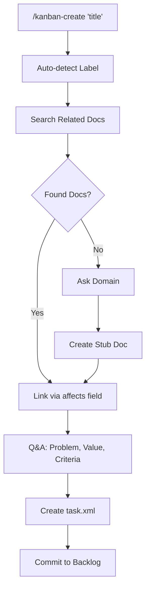

# Create Task

> **TL;DR:** Create new tasks through conversational Q&A with automatic doc linking

## Overview

Create Task allows developers to add new tasks to the backlog via the `/kanban-create` command. Claude conducts a conversational Q&A to capture the problem being solved, the value it provides, and Gherkin-format acceptance criteria. Tasks are automatically linked to relevant product and engineering documentation.

**Summary:** Entry point for new work items, capturing business context before technical scoping.

## How It Works



1. User runs `/kanban-create "task title"`
2. Claude auto-detects label (bug, feature, docs, refactor) from title keywords
3. Claude searches product/engineering docs for related features
4. Claude asks Q&A questions to understand problem, value, and acceptance criteria
5. Task XML created in `.kanban/tasks/{id}/task.xml` with status: backlog
6. Git commit with format: `docs({id}): create - {title}`

### Key Workflows

**New Feature (stub doc created):**
- Claude detects no matching product docs
- Asks user which domain the feature belongs to
- Creates stub product doc linked via `affects` field
- Stub completed later during /kanban-docs

**Bug Fix (existing feature):**
- Claude finds matching product docs (score >= 0.5)
- Automatically links via `affects` field
- No stub creation needed

**Summary:** Conversational creation with automatic documentation linking.

## Examples

### Typical Usage

```bash
# Create a bug fix task
/kanban-create Fix login redirect bug

# Claude asks questions, then creates:
# .kanban/tasks/002/task.xml
# Commit: docs(002): create - Fix login redirect bug
```

### Edge Case: New Feature

```bash
# Create a new feature (no existing docs)
/kanban-create Add dark mode toggle

# Claude asks: "What domain should it belong to?" [gui/settings/...]
# Creates stub: .kanban/product/gui/dark-mode.md
# Task links to stub via affects field
```

**Summary:** Tasks linked to existing docs or new stub docs automatically.

## Boundaries

What this feature does NOT do:

- **Does NOT:** Define technical approach → See [tasks/scope](./scope.md)
- **Does NOT:** Create implementation plan → See [tasks/plan](./plan.md)
- **Does NOT:** Start implementation → Task remains in backlog

## Configuration

| Setting | Description | Default |
|---------|-------------|---------|
| idPadding | Number of digits in task ID | 3 (e.g., 001) |
| labels | Available task labels | bug, feature, docs, refactor |

## Interactions

- **Product docs**: Searches and links via `affects` field
- **Engineering docs**: Searches and links via `engineering` field
- **tasks/scope**: Next step after creation

## Limitations

- Must be on main/master branch to create tasks
- One task created at a time (no batch creation)
- Acceptance criteria should be in Gherkin format
