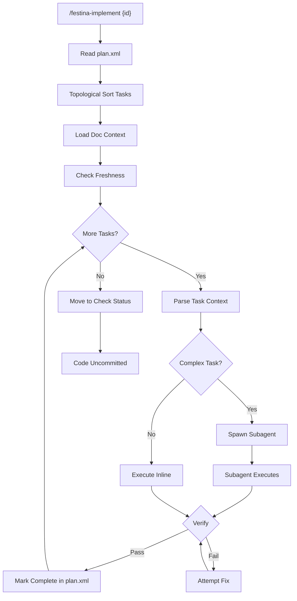

# Implement Task

> **TL;DR:** Execute plan steps with verification, code stays uncommitted

## Overview

Implement Task executes the implementation plan step-by-step using a subagent orchestration model. The orchestrator reads tasks from plan.xml and spawns fresh subagents for complex work. Each subagent receives explicit file context from the task's `<context>` block, executes the changes, and reports completion. Code remains uncommitted—this allows the check phase to verify before committing.

**Summary:** Subagent-based execution keeps orchestrator lean while delegating work.

## How It Works



1. User runs `/festina-implement {id}` on a planned task
2. Orchestrator reads plan.xml and calculates execution order (topological sort)
3. Loads smart context from relevant product/engineering docs
4. Checks doc freshness and warns if docs may be outdated
5. For each task in order:
   - Parse task's `<context>` block for required files
   - **Complex tasks**: Spawn fresh subagent with file context
   - **Simple tasks**: Execute inline to avoid overhead
   - Run verification command or manual check
   - Mark task complete with timestamp in plan.xml
6. When all tasks complete: move status to check
7. Code remains uncommitted for review

### Subagent Orchestration

The orchestrator stays lean (under 30% context usage) by delegating complex work:

- **Orchestrator role**: Parse plan, track progress, spawn subagents, persist completion
- **Subagent role**: Receive file context, execute single task, report result
- **No manual /clear required**: Fresh subagents prevent context bloat

Task completion is persisted to plan.xml after each task completes, ensuring resumability.

### Key Workflows

**Resumable implementation:**
- Each completed task marked in plan.xml
- If interrupted, `/festina-implement {id}` resumes from last incomplete task
- `/festina-save {id}` commits work-in-progress if needed

**Verification types:**
- Automatic: `<verify>npm run build</verify>` - executed
- Manual: `<verify>Manual: Check UI renders correctly</verify>` - user confirms

**Summary:** Step-by-step execution with subagent delegation and automatic or manual verification.

## Examples

### Typical Usage

```
[1/3] Create auth routes file
    Spawning subagent with context:
    - src/routes/auth.ts (create)
    - src/routes/users.ts (reference pattern)

Subagent executing...
Running verification: npx tsc --noEmit
Verification passed
Marking task 1 complete in plan.xml
Done criteria met: File exists and compiles
```

### Edge Case: Verification Failure

```
Running verification: npm run build
Verification failed: Type error in auth.ts:45

[Subagent analyzes error, attempts fix]

Running verification: npm run build
Verification passed
```

**Summary:** Claude handles verification failures with automatic fix attempts.

## Boundaries

What this feature does NOT do:

- **Does NOT:** Commit code - Code stays uncommitted
- **Does NOT:** Run full test suites - See [tasks/check](./check.md)
- **Does NOT:** Skip plan steps - Each step must execute
- **Does NOT:** Handle simple fixes - See [tasks/quick](./quick.md) for fast implementation

## Configuration

| Setting | Description | Default |
|---------|-------------|---------|
| context tier | Amount of doc context loaded | standard |
| stale-days | Days before docs considered stale | 30 |

## Interactions

- **tasks/plan**: Reads plan.xml for execution
- **docs/context-selection**: Loads relevant documentation and task context blocks
- **docs/freshness**: Warns about outdated docs
- **tasks/check**: Next step when complete
- **tasks/quick**: Fast alternative for simple fixes

## Limitations

- Must be on task/{id} branch
- Task must be in planned or in-progress status
- Circular dependencies in plan cause error
