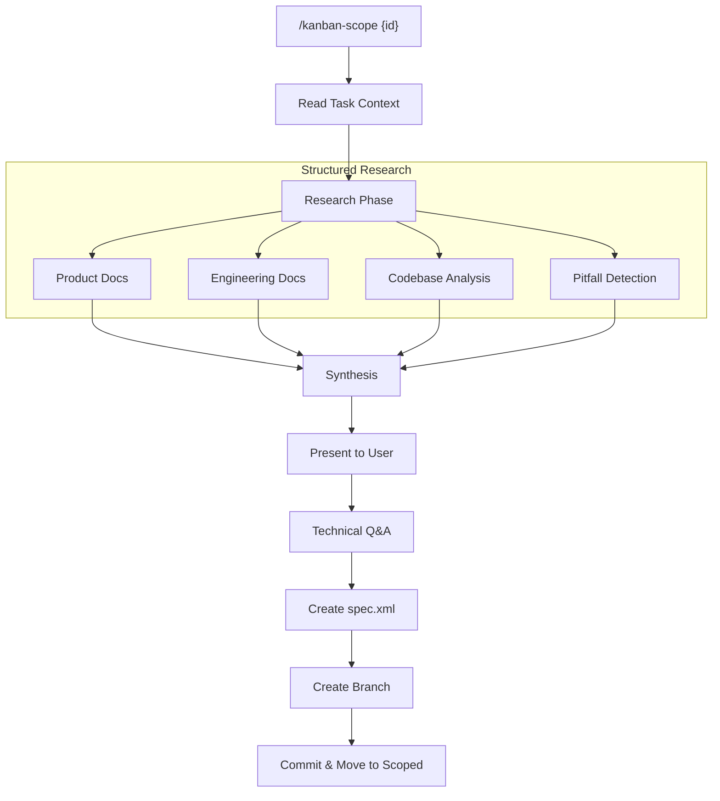

# Scope Task

> **TL;DR:** Research codebase and create functional specification through Q&A

## Overview

Scope Task transforms a backlog task into a scoped task with a complete functional specification. Claude conducts structured research across product docs, engineering docs, and the codebase, then engages in conversational Q&A to make technical decisions. This moves the task from backlog to scoped.

**Summary:** Bridges product requirements (from create) to technical specification (for plan).

## How It Works



1. User runs `/kanban-scope {id}` on a backlog task
2. Claude reads task's problem, value, and acceptance criteria
3. Structured research phase:
   - Product context: Read `affects` docs and search related
   - Engineering patterns: Read `engineering` docs and search related
   - Codebase analysis: Find similar implementations
   - Pitfall detection: Find TODO/FIXME, known issues
4. Present research synthesis for user approval
5. Conversational Q&A on technical decisions (approach, patterns, dependencies)
6. Create `spec.xml` with functional requirements, affected files, patterns
7. Create task branch: `task/{id}`
8. Update task status to scoped
9. Git commit: `docs({id}): scope - {title}`

### Key Workflows

**Research-then-discuss:**
- Claude presents synthesis: "Here's what I found..."
- User can request more research in specific areas
- Q&A focuses on technical decisions, not product requirements

**Summary:** Four-area research followed by technical decision Q&A.

## Examples

### Typical Usage

```xml
<!-- spec.xml -->
<spec task="001" created="2026-02-20">
  <context>{from task's problem and value}</context>
  <scope>
    <in-scope>What this spec covers</in-scope>
    <out-of-scope>Explicit boundaries</out-of-scope>
  </scope>
  <requirements>
    <requirement id="FR1">The system shall...</requirement>
    <requirement id="FR2">The system shall...</requirement>
  </requirements>
  <affected-files>
    <file action="modify">src/store/index.ts</file>
    <file action="create">src/hooks/usePersistedState.ts</file>
  </affected-files>
  <patterns>
    <pattern reference="src/store/settings.ts:42">Hydration pattern</pattern>
  </patterns>
</spec>
```

### Edge Case: Package Research

```bash
# User requests package research during Q&A
> Research reactive localStorage packages for React

# Claude uses WebSearch, presents options:
# - use-local-storage-state (150k downloads, tab sync)
# - @rehooks/local-storage (80k downloads, tab sync)

# User selects, Claude includes in spec's dependencies
```

**Summary:** Spec includes requirements, affected files, patterns, and dependencies.

## Boundaries

What this feature does NOT do:

- **Does NOT:** Create step-by-step implementation plan → See [tasks/plan](./plan.md)
- **Does NOT:** Execute any code changes → See [tasks/implement](./implement.md)
- **Does NOT:** Define product requirements → Those come from [tasks/create](./create.md)

## Configuration

| Setting | Description | Default |
|---------|-------------|---------|
| directives | Scoping rules to follow | From config.yaml |

## Interactions

- **tasks/create**: Reads problem, value, acceptance criteria
- **Product docs**: Reads `affects` docs for feature context
- **Engineering docs**: Reads `engineering` docs for patterns
- **tasks/plan**: Next step after scoping

## Limitations

- Must be on main/master branch (creates task branch)
- Task must be in backlog status
- Research quality depends on documentation completeness
