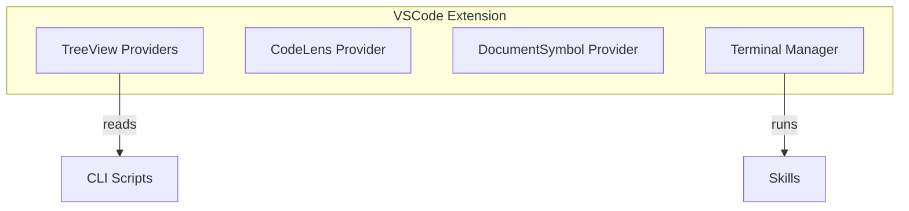

# VSCode Extension

> **TL;DR:** Visual kanban board, CodeLens actions, and terminal integration for VSCode

## Overview

The VSCode domain provides a visual interface for Festina Lente. The extension shows a sidebar kanban board, inline CodeLens actions on task files, plan outline navigation, and manages terminal sessions for running skills.

**Why it exists:** Visual task management without leaving the editor.

**Summary:** VSCode extension makes Festina Lente accessible through familiar IDE patterns.

## Extension Architecture



## Boundaries

This domain does NOT include the AI workflow logic. For that, see [skills](../skills/_index.md).

- **Does NOT:** Execute skill logic directly (invokes via terminal)
- **Does NOT:** Parse task XML (uses CLI for data)
- **See instead:** [skills/_index](../skills/_index.md) for workflow details

## Features

| Feature | Description | Status |
|---------|-------------|--------|
| [kanban-view](./kanban-view.md) | Sidebar TreeView with tasks by status | stable |
| [codelens](./codelens.md) | Inline actions on task.xml files | stable |
| [plan-outline](./plan-outline.md) | Outline navigation for plan.xml | stable |
| [terminal](./terminal.md) | Fresh terminal per command, YOLO mode | stable |
| [Directive Diagnostics](../directives/diagnostics.md) | Real-time directive XML validation | stable |

**Summary:** This domain contains 4 core features plus directive diagnostics for visual task management.

## TreeView Sections

The sidebar shows multiple collapsible sections:

```
FESTINA LENTE
├── TASKS
│   ├── ▼ In Progress (1)
│   │   └── 007: Add auth [feature]
│   ├── ▼ Planned (2)
│   └── ▼ Backlog (3)
├── QUICKS
├── PRODUCT DOCS
├── ENGINEERING DOCS
├── CONFIG
└── DIRECTIVES
```

## Key Concepts

- **Fresh Terminal**: Each command runs in a fresh terminal to ensure clean Claude context
- **File Watcher**: Monitors `.festinalente/` for changes and auto-refreshes views
- **Context-Aware Actions**: CodeLens shows only valid actions for current task status

## Relationships

| Related Domain | Relationship |
|----------------|--------------|
| [cli](../cli/_index.md) | Extension reads task data via CLI scripts |
| [skills](../skills/_index.md) | Extension invokes skills via terminal |
| [directives](../directives/_index.md) | Extension shows directives tree and validates XML |

**Summary:** VSCode extension orchestrates CLI, skills, and directives through a visual interface.
