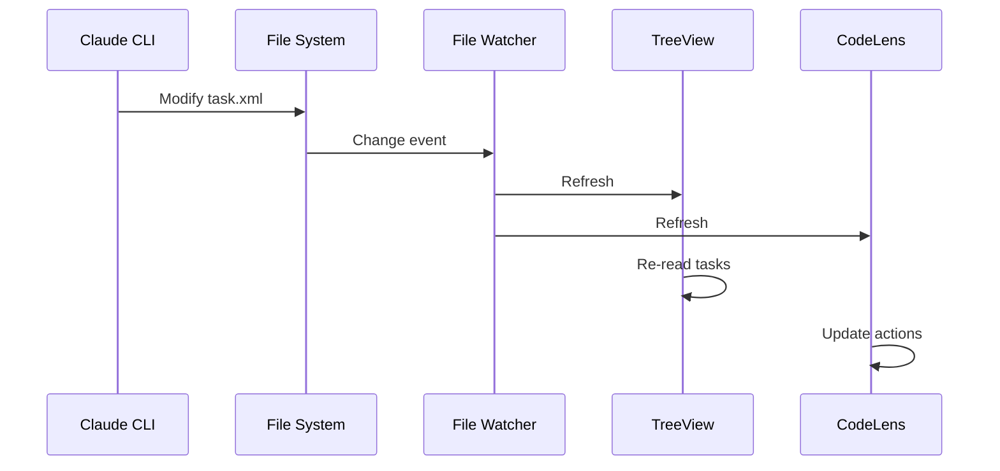

# File Watcher

> **TL;DR:** Auto-refresh UI when task files change

## Overview

File Watcher monitors the .kanban/tasks/ directory for file changes. When task.xml, spec.xml, or plan.xml files are created, modified, or deleted, it triggers a refresh of the TreeView and CodeLens providers. This keeps the UI in sync with command results.

**Summary:** Automatic UI synchronization with file changes.

## How It Works



1. Extension creates FileSystemWatcher for `.kanban/tasks/**/*.xml`
2. Watcher monitors create, change, delete events
3. On any event:
   - Refresh TreeView (task list)
   - Refresh CodeLens (action availability)
4. UI updates to reflect new state

### Key Workflows

**Change detection:**
- Command modifies task.xml → Watcher fires → UI refreshes
- New task created → Watcher fires → Appears in TreeView
- Task deleted → Watcher fires → Removed from TreeView

**Refresh scope:**
- TreeView: Full refresh (re-reads all tasks)
- CodeLens: Refreshes open task.xml files

**Summary:** Event-driven refresh for real-time UI updates.

## Examples

### Typical Flow

```
1. User clicks "Scope" in CodeLens
2. Terminal runs /kanban-scope 003
3. Claude updates task.xml (status: backlog → scoped)
4. Watcher detects change
5. TreeView moves task from Backlog to Scoped
6. CodeLens shows "Plan" instead of "Scope"
```

**Summary:** Seamless UI update after commands.

## Boundaries

What this feature does NOT do:

- **Does NOT:** Watch product/engineering docs
- **Does NOT:** Watch non-XML files
- **Does NOT:** Debounce rapid changes (may cause multiple refreshes)

## Configuration

| Setting | Description | Default |
|---------|-------------|---------|
| Watch pattern | Glob for watched files | .kanban/tasks/**/*.xml |

## Interactions

- **TreeView**: Refreshed on changes
- **CodeLens**: Refreshed on changes
- **Commands**: Trigger changes that watcher detects

## Limitations

- Watches only task XML files
- No debouncing (rapid changes may cause flicker)
- Full refresh each time (no incremental)
