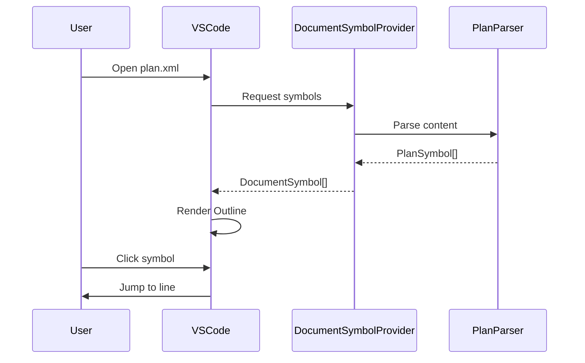
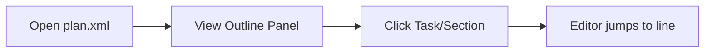

# Plan Outline Navigation

> **TL;DR:** Hierarchical navigation for plan.xml files via VSCode's Outline panel

## Overview

Plan Outline Navigation provides instant navigation within plan.xml files using VSCode's built-in Outline panel. Users see the full plan structure at a glance, including task completion status (checkmark vs circle), and can click any item to jump directly to that line. Also enables breadcrumb navigation at the top of the editor and Ctrl+Shift+O quick symbol search.

**Summary:** Visual plan structure with click-to-navigate and status indicators.

## How It Works



1. User opens a plan.xml file
2. VSCode requests document symbols from the provider
3. Provider parses XML content into hierarchical symbols
4. Outline panel displays the symbol tree
5. User clicks a symbol to navigate to that line

### Key Workflows

**Navigating via Outline:**



- Open a plan.xml file in the editor
- View → Open View → Outline (or use Activity Bar)
- Click any item in the tree to jump to that line

**Using Quick Picker:**

1. Press `Ctrl+Shift+O` (or `Cmd+Shift+O` on Mac)
2. Type to filter symbols
3. Select to navigate

**Summary:** Three navigation methods: Outline clicks, breadcrumbs, quick picker.

### User Interface

```
OUTLINE                                   [▼]
├── Plan 020: Add Document Symbol Prov...
│   ├── Overview
│   ├── Approach
│   ├── Tasks
│   │   ├── ✓ 1: Create plan-parser computer...
│   │   ├── ✓ 2: Create plan-symbol capability...
│   │   ├── ✓ 3: Add plan symbol provider...
│   │   ├── ✓ 4: Register DocumentSymbolProv...
│   │   └── ✓ 5: Final verification of all...
│   ├── Testing
│   │   ├── Automated
│   │   ├── Manual
│   │   └── Regression
│   ├── Edge-cases
│   │   ├── Malformed XML content
│   │   ├── Empty plan.xml file
│   │   └── ...
│   └── Pitfalls
│       ├── fast-xml-parser line positions
│       └── ...
```

**Status indicators:**
- `✓` (checkmark) - Completed task
- `○` (circle) - Pending task

## Examples

### Typical Outline View

When viewing a plan.xml file, the Outline shows:

```
Plan 001: Add localStorage persistence
├── Overview
├── Approach
├── Tasks
│   ├── ✓ 1: Create storage computer
│   ├── ✓ 2: Create storage capability
│   ├── ○ 3: Add persistence logic
│   └── ○ 4: Wire up orchestrator
├── Testing
│   ├── Automated
│   ├── Manual
│   └── Regression
└── Edge-cases
    ├── Storage full scenario
    └── Invalid JSON data
```

### Quick Symbol Picker

Press `Ctrl+Shift+O` to see:

```
┌─────────────────────────────────────────────────────┐
│ @                                                   │
├─────────────────────────────────────────────────────┤
│ ⊕ Plan 001: Add localStorage persistence           │
│   ◇ Overview                                        │
│   ◇ Approach                                        │
│   ◇ Tasks                                           │
│     ◇ ✓ 1: Create storage computer                 │
│     ◇ ✓ 2: Create storage capability               │
│   ◇ Testing                                         │
│   ...                                               │
└─────────────────────────────────────────────────────┘
```

Type to filter (e.g., "storage" to find storage-related tasks).

**Summary:** Hierarchical view with status, searchable via quick picker.

## Boundaries

What this feature does NOT do:

- **Does NOT:** Show on task.xml or spec.xml → See [CodeLens](./codelens.md) for task actions
- **Does NOT:** Allow editing from Outline (navigation only)
- **Does NOT:** Show custom icons/colors (uses native VSCode theme)
- **Does NOT:** Provide sidebar tree view → See [Kanban View](./kanban-view.md)

## Configuration

| Setting | Description | Default |
|---------|-------------|---------|
| - | No specific configuration | Uses VSCode Outline settings |

## Interactions

- **File Watcher**: Refreshes symbols when plan.xml changes on disk
- **Breadcrumbs**: Automatically shows current position in hierarchy
- **Go to Symbol**: Ctrl+Shift+O works automatically once registered

## Limitations

- Long labels truncated at 60 characters with "..."
- Only plan.xml files in `.kanban/tasks/*/` pattern
- Malformed XML shows empty Outline (no crash)
- Nesting depth limited to keep Outline readable
