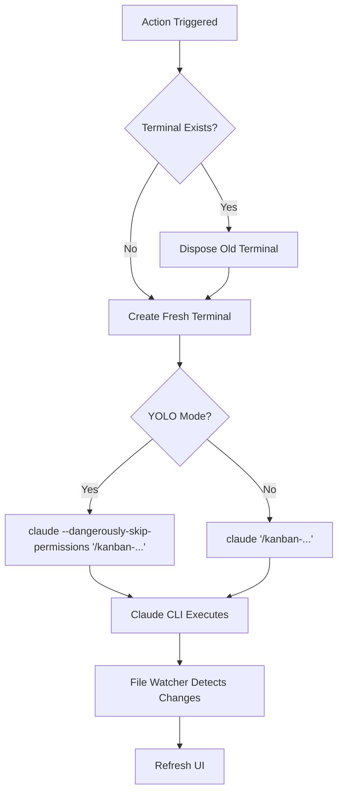

# Terminal Integration

> **TL;DR:** Integrated terminal for executing Claude kanban commands

## Overview

Terminal Integration manages the VSCode integrated terminal for running kanban commands. It creates a fresh terminal for each action, disposing any existing "Claude Kanban" terminal first. This ensures each kanban action runs with a completely clean Claude context, preventing command interference between sessions.

**Summary:** Bridge between VSCode UI and Claude CLI with context isolation.

## How It Works



1. Action triggered (CodeLens click, command palette)
2. Terminal capability finds or creates terminal
3. Sends command text to terminal
4. Terminal shows Claude CLI interaction
5. File watcher detects changes and refreshes UI

### Key Workflows

**Terminal lifecycle:**
- Existing "Claude Kanban" terminal disposed before each action
- Fresh terminal created for each action
- Named "Claude Kanban" for identification
- Ensures clean Claude context for every command

**Command execution:**
- Commands sent as text input
- Format: `claude "/kanban-{action} {id}"`
- Claude CLI handles the rest

**YOLO mode detection:**
- Reads Claude settings from project (`.claude/settings.json`) or global (`~/.claude/settings.json`)
- Project-level settings take precedence over global settings
- Detects YOLO mode when `"dangerously-skip-permissions": true` or `"defaultMode": "bypassPermissions"`
- When enabled, commands use `claude --dangerously-skip-permissions "/kanban-..."` format
- Silent degradation if settings files are missing or invalid (falls back to normal mode)

**Summary:** Managed terminal for Claude command execution with automatic YOLO mode support.

## Examples

### Typical Usage

```
// User clicks "Scope" on task 003

// Terminal opens/focuses with:
$ claude "/kanban-scope 003"

// Claude CLI executes the scoping workflow
Scoping task 003 "Add dark mode toggle"...
```

### Create Task via Command Palette

```
// User runs "Kanban: Create Task"
// Input box appears: "Enter task title"
// User enters: "Fix login redirect bug"

// Terminal runs:
$ claude "/kanban-create Fix login redirect bug"
```

### YOLO Mode Enabled

```
// User has .claude/settings.json with:
{ "dangerously-skip-permissions": true }

// OR with:
{ "defaultMode": "bypassPermissions" }

// Terminal runs commands with flag:
$ claude --dangerously-skip-permissions "/kanban-scope 003"

// Result: No permission prompts during Claude execution
```

**Summary:** Commands executed via Claude CLI in terminal with automatic YOLO mode detection.

## Boundaries

What this feature does NOT do:

- **Does NOT:** Parse command output
- **Does NOT:** Run commands without Claude CLI
- **Does NOT:** Provide interactive prompts (Claude handles that)

## Configuration

| Setting | Description | Default |
|---------|-------------|---------|
| Terminal name | Name for dedicated terminal | Claude Kanban |

### Claude Settings (External)

YOLO mode is controlled by Claude's own settings files, not VSCode settings:

| File | Scope | Precedence |
|------|-------|------------|
| `.claude/settings.json` | Project-level | Higher (checked first) |
| `~/.claude/settings.json` | Global | Lower (fallback) |

Enable YOLO mode with either:
- `"dangerously-skip-permissions": true`
- `"defaultMode": "bypassPermissions"`

## Interactions

- **CodeLens**: Triggers command execution
- **Create task**: Uses input box then terminal
- **All actions**: Route through terminal

## Limitations

- Requires Claude CLI installed
- No output parsing (relies on file changes)
- Terminal history cleared between actions (by design for context isolation)
