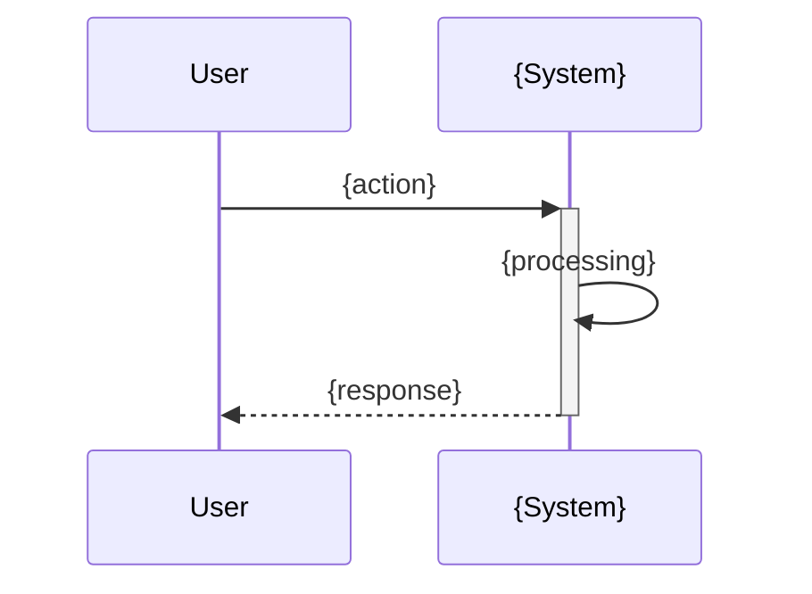

# {Feature Name}

> **TL;DR:** {tldr repeated}

## Overview

{Feature Name} allows users to {do what}. This is important because {reason/value}.

**Summary:** {Brief recap of the feature's purpose}

## How It Works



1. User {action}
2. System {response}
3. Result: {outcome}

### Key Workflows

**{Workflow Name}:**

```mermaid
flowchart LR
    A[{Step 1}] --> B[{Step 2}]
    B --> C[{Step 3}]
```

- {Step 1}
- {Step 2}
- {Step 3}

**Summary:** {Brief recap of the main workflow}

### User Interface

```
┌─────────────────────────────────┐
│  {Feature UI}             [X]  │
├─────────────────────────────────┤
│  {UI description}               │
│                                 │
│      [ {Action} ]               │
└─────────────────────────────────┘
```

## Examples

### Typical Usage

```{language}
// {file path where this is used}
{code example}
```

### Edge Case: {scenario}

```{language}
// {what happens when}
{code example}
```

**Summary:** {Brief recap of key examples}

## Boundaries

What this feature does NOT do:

- **Does NOT:** {thing 1} → See [{related-feature}]({path})
- **Does NOT:** {thing 2}

## Configuration

| Setting | Description | Default |
|---------|-------------|---------|
| {setting} | {what it does} | {default value} |

## Interactions

- **{Related Feature}**: {How they interact}
- **{Related Feature}**: {How they interact}

## Limitations

- {Limitation 1}
- {Limitation 2}
