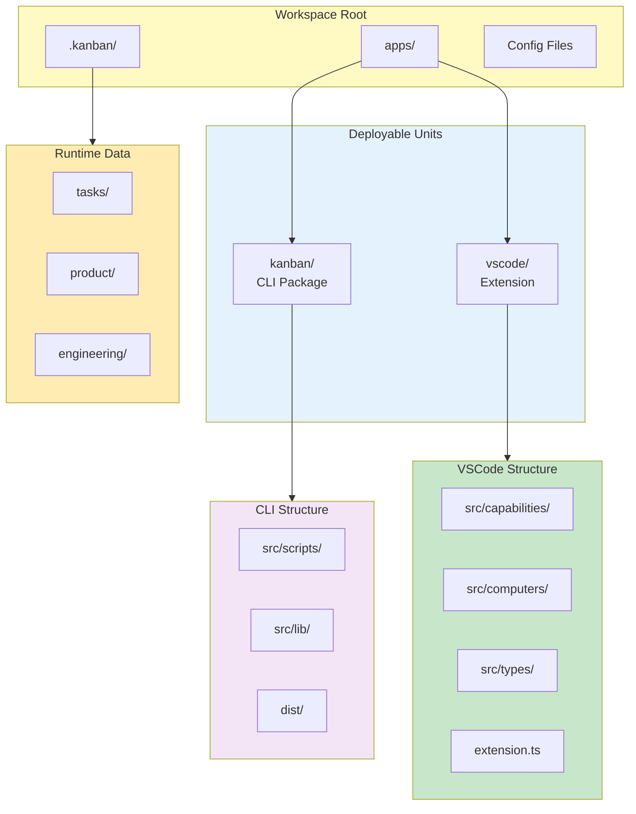

# Folder Structure Convention

> **TL;DR:** Monorepo with apps/, shared tooling at root, .kanban/ for runtime data

## Rule

1. **Apps:** Each deployable in `apps/{name}/`
2. **Source:** TypeScript source in `apps/{name}/src/`
3. **Build Output:** Compiled output in `apps/{name}/dist/`
4. **VSCode Extension:** Uses `capabilities/`, `computers/`, `types/` subdirectories
5. **Runtime Data:** User data in `.kanban/` at workspace root
6. **Root Config:** Shared tooling (turbo.json, tsconfig.base.json) at root

## Rationale

- `apps/` clearly separates deployable units
- `src/` vs `dist/` distinguishes source from build output
- Capability/computer separation enforces clean architecture
- `.kanban/` isolates runtime data from source



**Summary:** Predictable structure enables fast navigation across the monorepo.

## Examples

### Correct

```
claudeban/                          # Workspace root
├── apps/
│   ├── kanban/                     # CLI tool package
│   │   ├── src/
│   │   │   ├── scripts/           # CLI commands
│   │   │   ├── lib/               # Shared utilities
│   │   │   └── content/           # Templates, skills
│   │   ├── dist/                  # Build output
│   │   ├── package.json
│   │   └── tsconfig.json
│   └── vscode/                    # VSCode extension
│       ├── src/
│       │   ├── capabilities/      # I/O layer
│       │   ├── computers/         # Pure functions
│       │   ├── types/             # Type definitions
│       │   └── extension.ts       # Entry point
│       ├── out/                   # Build output
│       └── package.json
├── .kanban/                       # Runtime data (gitignored tasks)
│   ├── tasks/                     # Task instances
│   ├── product/                   # Product docs
│   ├── engineering/               # Engineering docs
│   └── config.yaml                # Configuration
├── turbo.json                     # Build orchestration
├── pnpm-workspace.yaml            # Workspace definition
└── tsconfig.base.json             # Shared TS config
```

### Incorrect

```
src/                    # Violates: no apps/ separation
  kanban/
  vscode/

apps/kanban/scripts/    # Violates: missing src/ level
apps/kanban/src/utils/  # Violates: should be lib/ for shared code

kanban-data/            # Violates: should be .kanban/
```

**Summary:** apps/ for deployables, src/ for source, .kanban/ for runtime data.

## Boundaries

When this convention does NOT apply:

- Third-party dependencies (node_modules)
- Build tool cache directories (.turbo, .pnpm-store)
- IDE configuration (.vscode, .idea)

## Enforcement

- Code review
- Build tools expect specific paths
- pnpm-workspace.yaml defines valid packages
