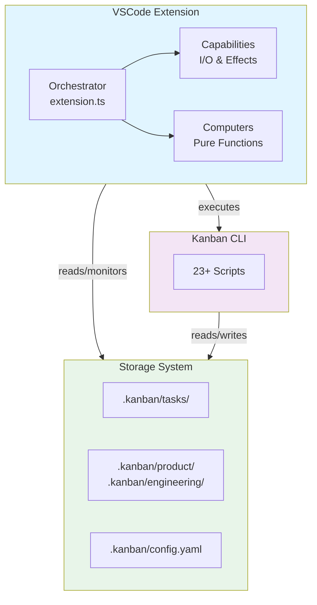

# Claude Kanban Engineering Overview

> **TL;DR:** Monorepo with CLI scripts and VSCode extension for AI-assisted task management

## Tech Stack

| Category | Technology |
|----------|------------|
| Language | TypeScript 5.7+, Node.js >=18 |
| Framework | VSCode Extension API 1.85 |
| Database | None (file-based storage) |
| Build Tool | pnpm 9.15+, Turbo 2.8+, tsdown, esbuild |
| Testing | None configured |

**Summary:** Pure TypeScript monorepo using pnpm workspaces with Turbo orchestration. File-based data model using XML for tasks and YAML/Markdown for documentation.

## Architecture Summary

Claude Kanban is a pnpm monorepo containing two tightly-coupled applications: a CLI tool (`apps/kanban`) providing 23+ utility scripts, and a VSCode extension (`apps/vscode`) providing visual task management. Both communicate through the file system and terminal commands.

**Why it exists:** Designed for integration with Claude Code AI assistant, separating concerns between pure computation (Computers), I/O operations (Capabilities), and orchestration (extension.ts).

**Summary:** Two-app monorepo with factory function DI pattern, file-based persistence, and hybrid fuzzy search.



## Directory Structure

```
claudeban/
├── apps/
│   ├── kanban/                    # CLI tool (npm package)
│   │   ├── src/
│   │   │   ├── scripts/           # 23+ utility scripts
│   │   │   ├── lib/               # Shared libraries
│   │   │   └── content/           # Skills, templates, partials
│   │   ├── tools/                 # Build tooling
│   │   └── dist/                  # Compiled output
│   └── vscode/                    # VSCode extension
│       └── src/
│           ├── orchestrators/     # Domain orchestrators (optional)
│           ├── capabilities/      # I/O and side effects
│           ├── computers/         # Pure functions
│           ├── types/             # Type definitions
│           └── extension.ts       # Composition root / entry point
├── .kanban/                       # Runtime data directory
│   ├── tasks/                     # Task instances (XML)
│   ├── product/                   # Product docs (MD)
│   ├── engineering/               # Engineering docs (MD)
│   ├── directives/                # Skill directives (XML)
│   ├── scripts/                   # Runtime scripts
│   ├── templates/                 # Document templates
│   ├── config.yaml                # Global configuration
│   └── glossary.yaml              # Term aliases
└── turbo.json                     # Build orchestration
```

**Summary:** Monorepo with two apps, shared build tooling, and a `.kanban/` runtime directory for data persistence.

## Boundaries

What this overview does NOT cover:

- **Does NOT:** Detail individual script implementations → See [systems/cli](systems/cli/_index.md)
- **Does NOT:** Explain VSCode capability internals → See [systems/vscode-extension](systems/vscode-extension/_index.md)
- **Does NOT:** Define coding standards → See [conventions/](conventions/)

## Key Patterns

- [orchestrator](patterns/orchestrator.md) - Policy decisions (when/whether to act) and composition
- [capability-computer](patterns/capability-computer.md) - Separation of I/O from pure functions
- [factory-di](patterns/factory-di.md) - Factory function dependency injection for testability
- [tagged-union-errors](patterns/tagged-union-errors.md) - Discriminated union error handling

## Systems

- [cli](systems/cli/_index.md) - Kanban CLI script engine
- [vscode-extension](systems/vscode-extension/_index.md) - VSCode UI layer
- [search](systems/search/_index.md) - Hybrid fuzzy search engine
- [storage](systems/storage/_index.md) - File-based data persistence

## Conventions

- [file-naming](conventions/file-naming.md) - kebab-case for files, PascalCase for types
- [error-handling](conventions/error-handling.md) - Tagged union JSON output pattern
- [folder-structure](conventions/folder-structure.md) - Monorepo organization rules
