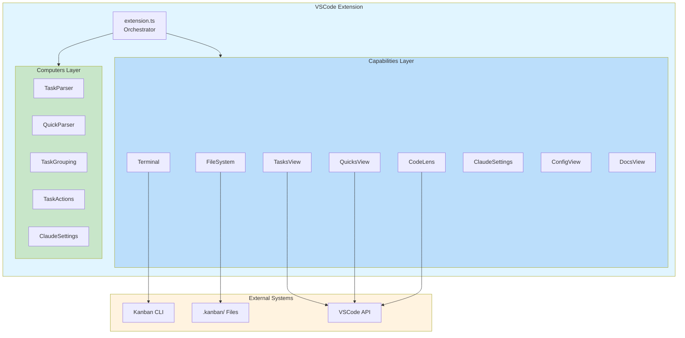
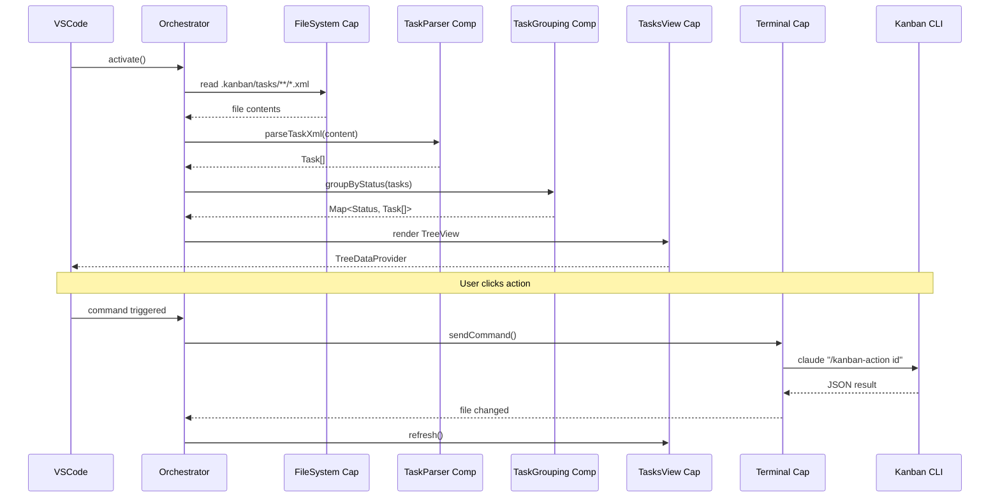

# VSCode Extension

> **TL;DR:** Visual task management UI with TreeView, CodeLens, and terminal integration

## Overview

The VSCode extension provides a visual interface for Claude Kanban. It renders tasks in a TreeView panel, adds CodeLens actions to task files, and executes kanban commands via integrated terminal. The extension follows a three-layer architecture: Orchestrator, Capabilities, and Computers.

**Why it exists:** Provides a visual UI for task management while delegating data operations to CLI scripts, maintaining clean separation of concerns.

**Summary:** Visual interface layer that renders data and triggers CLI commands.

## Architecture Layers

### Orchestrator Layer

The `extension.ts` file acts as the orchestrator, making policy decisions (when/whether to act) and coordinating between capabilities and computers. See [orchestrator pattern](../patterns/orchestrator.md) for full documentation.

| Responsibility | Description |
|----------------|-------------|
| Activation | Starts on `onStartupFinished`, initializes all capabilities |
| File monitoring | Watches `.kanban/tasks/**/*.xml` for changes |
| Command routing | Routes VSCode commands to appropriate handlers |
| Header actions | Registers view/title menu items (discovery, create, refresh) |
| Composition | Wires capabilities and computers together |

**File:** `apps/vscode/src/extension.ts`

#### Orchestrator Decomposition

Currently, `extension.ts` handles multiple domains (Tasks, Quicks, Docs, Config, Terminal). As the extension grows, consider decomposing into domain orchestrators:

```
apps/vscode/src/
├── extension.ts                    # Thin composition root
├── orchestrators/
│   ├── tasks.orchestrator.ts       # Task domain policy
│   ├── quicks.orchestrator.ts      # Quick task domain policy
│   ├── docs.orchestrator.ts        # Documentation domain policy
│   └── terminal.orchestrator.ts    # Execution/runtime policy
├── capabilities/
└── computers/
```

**When to decompose:**
- `extension.ts` exceeds ~300 lines
- Domains have independent lifecycles or state
- Policy logic becomes hard to test
- Adding a new domain requires touching unrelated code

See [orchestrator pattern - decomposition](../patterns/orchestrator.md#orchestrator-decomposition) for detailed guidance.

### Capabilities Layer (Mechanism/How)

Capabilities handle I/O and side effects. They wrap VSCode APIs and file system operations.

| Component | Purpose | File |
|-----------|---------|------|
| file-system | File I/O wrapper (read, write, exists) | `capabilities/file-system.capability.ts` |
| tasks-view | TreeView rendering and management | `capabilities/tasks-view.capability.ts` |
| quicks-view | TreeView for quick tasks list | `capabilities/quicks-view.capability.ts` |
| terminal | Terminal lifecycle (fresh per action) | `capabilities/terminal.capability.ts` |
| claude-settings | Read Claude settings from project/global paths | `capabilities/claude-settings.capability.ts` |
| codelens | CodeLens provider for quick actions | `capabilities/codelens.capability.ts` |
| config-view | TreeView for config.yaml access | `capabilities/config-view.capability.ts` |
| global-actions-view | TreeView for global project commands | `capabilities/global-actions-view.capability.ts` |
| docs-view | TreeViews for browsing product/engineering docs | `capabilities/docs-view.capability.ts` |

#### TreeItem Types in tasks-view

The tasks-view capability defines these TreeItem types:

| TreeItem | Parent | Purpose |
|----------|--------|---------|
| StatusGroupItem | root | Column header (e.g., "Backlog", "In Progress") |
| TaskItem | StatusGroupItem | Task entry with ID, title, priority, label |
| ActionItem | TaskItem | Workflow action (primary: green play, secondary: orange reply) |
| FileItem | TaskItem | Task file (task.xml, spec.xml, plan.xml) |

ActionItems appear as the first children when expanding a TaskItem (unless task is in "done" status). Tasks may have multiple actions: primary action (index 0) uses green play icon, secondary actions (index > 0) use orange reply icon.

#### Parent Tracking for reveal()

The TreeDataProvider implements `getParent()` to enable VSCode's `TreeView.reveal()` API (used by Find Task). Parent relationships are tracked using Maps populated when children are created:

| Map | Key | Value | Purpose |
|-----|-----|-------|---------|
| `taskToStatusGroup` | task.id | StatusGroupItem | FR3: TaskItem → parent column |
| `childToTask` | ActionItem\|FileItem | TaskItem | FR4: child → parent task |

`getParent()` returns:
- `undefined` for StatusGroupItem (root level)
- StatusGroupItem lookup for TaskItem
- TaskItem lookup for ActionItem/FileItem

Maps are cleared on refresh alongside existing caches to avoid stale references.

#### TreeItem Types in quicks-view

The quicks-view capability defines:

| TreeItem | Parent | Purpose |
|----------|--------|---------|
| QuickItem | root | Quick task entry with ID, title, status icon |

QuickItem displays quick tasks as a flat list. Status icons: blue play circle for `in-progress`, green checkmark for `complete`. Uses `kanban.openFile` command to open quick.xml in editor.

#### TreeItem Types in config-view

The config-view capability defines:

| TreeItem | Parent | Purpose |
|----------|--------|---------|
| ConfigItem | root | Config file entry (gear icon, click-to-open) |

ConfigItem uses `kanban.openFile` command to open config.yaml in editor.

#### TreeItem Types in docs-view (Actions)

The docs-view capability defines action items at the top of each docs section:

| TreeItem | Parent | Purpose |
|----------|--------|---------|
| DocsActionItem | root (first child) | Clickable action with green play icon (e.g., "Map Product Docs", "Map Engineering Docs") |

DocsActionItem uses `kanban.runGlobalAction` command to execute the action in a terminal. Both "Map Product Docs" and "Map Engineering Docs" use green play button icons (`play` with `charts.green` color) for visual consistency with other executable actions.

#### TreeItem Types in docs-view

The docs-view capability defines:

| TreeItem | Parent | Purpose |
|----------|--------|---------|
| DocsFolderItem | root or DocsFolderItem | Collapsible folder in docs hierarchy |
| DocsFileItem | DocsFolderItem | Clickable markdown file (opens in editor) |

DocsFolderItem and DocsFileItem use path-based parent tracking via Maps populated during getChildren(). Both use `kanban.openFile` command for file opening.

#### Header Action Commands

Header buttons are registered via `contributes.menus.view/title` in package.json:

**TASKS View:**

| Command | Icon | Group | Behavior |
|---------|------|-------|----------|
| `kanban.startDiscovery` | `comment-discussion` | navigation@0 | Runs `/kanban-discover` in terminal |
| `kanban.createTask` | `add` | navigation@1 | Prompts for title, runs `/kanban-create` |
| `kanban.refresh` | `refresh` | navigation@2 | Triggers TreeView refresh |
| `kanban.findTask` | `search` | navigation@3 | Opens QuickPick to search tasks |

**QUICKS View:**

| Command | Icon | Group | Behavior |
|---------|------|-------|----------|
| `kanban.createQuick` | `add` | navigation@1 | Prompts for title, runs `/kanban-quick` |
| `kanban.refreshQuicks` | `refresh` | navigation@2 | Triggers Quicks TreeView refresh |
| `kanban.findQuick` | `search` | navigation@3 | Opens QuickPick to search quick tasks |

Commands use VSCode's extended title syntax for rich markdown tooltips (e.g., "Kanban: Start Discovery - Explore questions through Socratic Q&A").

### Computers Layer (Pure Functions)

Computers contain pure functions with no side effects. They transform data.

| Component | Purpose | File |
|-----------|---------|------|
| task-parser | Parses XML task files using fast-xml-parser | `computers/task-parser.computer.ts` |
| quick-parser | Parses quick.xml files using fast-xml-parser | `computers/quick-parser.computer.ts` |
| task-grouping | Groups tasks by status, defines columns | `computers/task-grouping.computer.ts` |
| task-actions | Generates available actions per task status | `computers/task-actions.computer.ts` |
| claude-settings | YOLO mode detection from Claude settings | `computers/claude-settings.computer.ts` |

### Types Layer

Type definitions shared across the extension.

| Component | Purpose | File |
|-----------|---------|------|
| task-types | Task, TaskStatus, TaskPriority, TaskAction interfaces | `types/task-types.ts` |
| quick-types | Quick, QuickStatus interfaces | `types/quick-types.ts` |

**Summary:** Three layers separate concerns: Orchestrator (when), Capabilities (how), Computers (what).

### Architecture Diagram



### TreeView Hierarchy

```
┌─────────────────────────────────────────────┐
│  KANBAN TASKS                    [+] [↻]   │
├─────────────────────────────────────────────┤
│  ▼ In Progress (2)                          │
│  │  ├── ▼ 001 Implement login               │
│  │  │   ├── ▶ Continue                      │
│  │  │   ├── task.xml                        │
│  │  │   ├── spec.xml                        │
│  │  │   └── plan.xml                        │
│  │  └── ▼ 002 Fix auth bug                  │
│  │      ├── ▶ Continue                      │
│  │      └── task.xml                        │
│  ▼ Backlog (3)                              │
│  │  ├── 003 Add logout button               │
│  │  ├── 004 Update dashboard                │
│  │  └── 005 Write tests                     │
│  ▶ Done (5)                                 │
└─────────────────────────────────────────────┘
```

## Key Patterns

This system follows these patterns:

- [capability-computer](../patterns/capability-computer.md) - Strict separation of I/O from pure functions
- [factory-di](../patterns/factory-di.md) - All components use factory functions for dependency injection
- Event Emitter pattern for state updates (VSCode EventEmitters trigger UI refresh)

## Data Flow



```
VSCode Extension (activate)
  ↓
Orchestrator loads .kanban folder
  ↓
Read task.xml files via FileSystem Capability
  ↓
Parse via TaskParser Computer
  ↓
Group via TaskGrouping Computer
  ↓
Render TreeView via TasksView Capability
  ↓
Generate CodeLens via CodeLens Capability
  ↓
User clicks action → Execute command via Terminal Capability
  ↓
Claude Settings Capability reads .claude/settings.json (project & global)
  ↓
Claude Settings Computer determines YOLO mode status
  ↓
Terminal runs claude command (with --dangerously-skip-permissions if YOLO)
  ↓
File watcher detects change → Refresh cycle
```

## Interactions

| System | Relationship | Notes |
|--------|--------------|-------|
| [cli](../cli/_index.md) | Executes commands | Runs `claude "/kanban-{action} {id}"` via terminal |
| [storage](../storage/_index.md) | Reads files | Monitors `.kanban/tasks/**/*.xml` |
| [distribution](../distribution/_index.md) | Distributed via | Published to GitHub Packages, installed via npx |

**Summary:** Extension reads files, renders UI, and sends commands to CLI via terminal.

## YOLO Mode Detection

The extension reads Claude's settings files to detect if YOLO mode (bypass permissions) is enabled.

### Settings Locations

| Location | Priority | Example Path |
|----------|----------|--------------|
| Project | Higher | `.claude/settings.json` |
| Global | Lower | `~/.claude/settings.json` |

Project-level settings take precedence over global settings.

### Detection Logic

YOLO mode is enabled when either of these conditions is true:
- `"dangerously-skip-permissions": true` (strict boolean equality)
- `"defaultMode": "bypassPermissions"` (exact string match)

### Implementation

The feature follows the capability-computer pattern:

| Layer | Component | Responsibility |
|-------|-----------|----------------|
| Capability | `claude-settings.capability.ts` | I/O: Read settings files from disk |
| Computer | `claude-settings.computer.ts` | Pure: Determine YOLO status from settings |
| Orchestrator | `extension.ts:getClaudeCommand()` | Policy: Build command with/without flag |

### Command Format

```typescript
// YOLO enabled:
`claude --dangerously-skip-permissions "/kanban-{action} {id}"`

// YOLO disabled:
`claude "/kanban-{action} {id}"`
```

### Silent Degradation

If settings files are missing, unreadable, or contain invalid JSON, the system silently falls back to normal mode (no flag). This ensures the extension works without errors even when Claude isn't configured.

## Distribution

The extension is distributed via GitHub Packages as an npm package containing the bundled .vsix file.

### Installation

```bash
npx @mattfletcher94/claudeban-vscode
```

### How It Works

1. Extension is built and packaged into a .vsix file
2. npm package includes `bin/install.cjs` and the .vsix file
3. When user runs npx, installer finds the .vsix and runs `code --install-extension`

### Package Structure

```
@mattfletcher94/claudeban-vscode
├── bin/
│   └── install.cjs      # CLI installer
├── claudeban-vscode.vsix  # Bundled extension
└── package.json         # npm package with bin entry
```

See [distribution](../distribution/_index.md) for full publishing workflow.

## Boundaries

What this system does NOT handle:

- **Does NOT:** Implement search algorithms → See [search](../search/_index.md)
- **Does NOT:** Validate or transform data → Delegates to CLI scripts
- **Does NOT:** Persist data → See [storage](../storage/_index.md)

## Configuration

| Setting | Description | Default |
|---------|-------------|---------|
| `kanban.enable` | Enable/disable extension | true |
| `kanban.showInactiveColumns` | Show columns with no tasks | false |

## Known Issues

| Severity | Issue | Location |
|----------|-------|----------|
| HIGH | Dependency version mismatch (fast-xml-parser 4.x vs 5.x in CLI) | `package.json` |
| MEDIUM | Silent failures in parsing errors | `extension.ts:93-95` |
| MEDIUM | No error feedback for terminal commands | `terminal.capability.ts` |
| LOW | Potential N+1 loading pattern | `extension.ts:72-102` |
