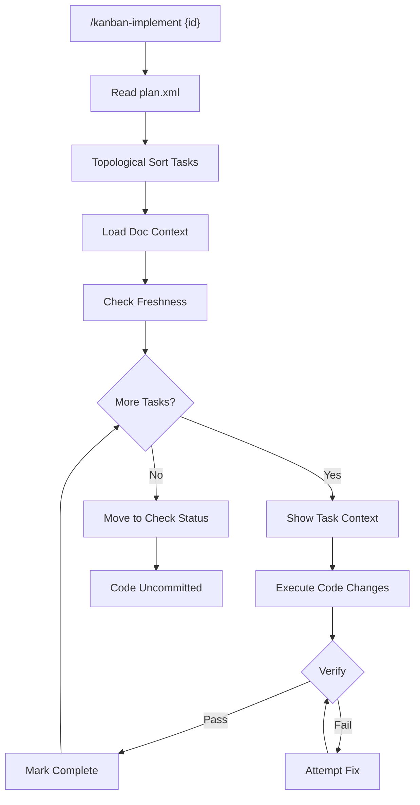

# Implement Task

> **TL;DR:** Execute plan steps with verification, code stays uncommitted

## Overview

Implement Task executes the implementation plan step-by-step. Claude reads each task from plan.xml, makes the code changes, runs verification commands, and marks tasks complete. Code remains uncommitted—this allows the check phase to verify before committing.

**Summary:** Controlled execution of plan with verification at each step.

## How It Works



1. User runs `/kanban-implement {id}` on a planned task
2. Claude reads plan.xml and calculates execution order (topological sort)
3. Loads smart context from relevant product/engineering docs
4. Checks doc freshness and warns if docs may be outdated
5. For each task in order:
   - Show task context (files, requirements, pattern)
   - Execute the action (code changes)
   - Run verification command or manual check
   - Mark task complete with timestamp
6. When all tasks complete: move status to check
7. Code remains uncommitted for review

### Key Workflows

**Resumable implementation:**
- Each completed task marked in plan.xml
- If interrupted, `/kanban-implement {id}` resumes from last incomplete task
- `/kanban-save {id}` commits work-in-progress if needed

**Verification types:**
- Automatic: `<verify>npm run build</verify>` - executed
- Manual: `<verify>Manual: Check UI renders correctly</verify>` - user confirms

**Summary:** Step-by-step execution with automatic or manual verification.

## Examples

### Typical Usage

```
━━━━━━━━━━━━━━━━━━━━━━━━━━━━━━━━━━━━━━━━━━━━━━━━━━━━━━━━━━━━
[1/3] Create auth routes file
━━━━━━━━━━━━━━━━━━━━━━━━━━━━━━━━━━━━━━━━━━━━━━━━━━━━━━━━━━━━
**Files:** src/routes/auth.ts (create)
**Requirements:** FR1
**Pattern:** Route pattern at src/routes/users.ts:15

Creating src/routes/auth.ts...
Running verification: npx tsc --noEmit
✓ Verification passed
Done criteria met: File exists and compiles
```

### Edge Case: Verification Failure

```
Running verification: npm run build
✗ Verification failed: Type error in auth.ts:45

[Claude analyzes error, attempts fix]

Running verification: npm run build
✓ Verification passed
```

**Summary:** Claude handles verification failures with automatic fix attempts.

## Boundaries

What this feature does NOT do:

- **Does NOT:** Commit code → Code stays uncommitted
- **Does NOT:** Run full test suites → See [tasks/check](./check.md)
- **Does NOT:** Skip plan steps → Each step must execute

## Configuration

| Setting | Description | Default |
|---------|-------------|---------|
| context tier | Amount of doc context loaded | standard |
| stale-days | Days before docs considered stale | 30 |

## Interactions

- **tasks/plan**: Reads plan.xml for execution
- **docs/context-selection**: Loads relevant documentation
- **docs/freshness**: Warns about outdated docs
- **tasks/check**: Next step when complete

## Limitations

- Must be on task/{id} branch
- Task must be in planned or in-progress status
- Circular dependencies in plan cause error
