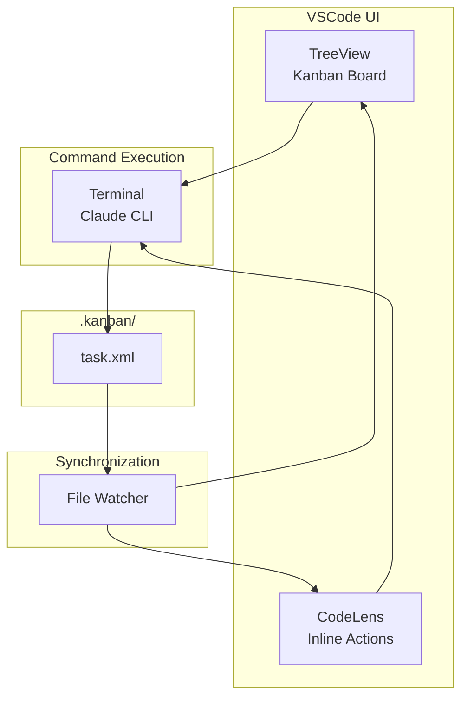

# VSCode Extension

> **TL;DR:** Visual kanban board with CodeLens actions and terminal integration

## Overview

The VSCode Extension domain provides a visual interface for Claude Kanban within VSCode. It displays a sidebar kanban board with tasks grouped by status, adds CodeLens actions to task.xml files, and integrates with the terminal to run kanban commands via Claude CLI.

**Why it exists:** Visual task management while coding, without leaving the editor.

**Summary:** This domain provides VSCode integration for visual kanban workflow.

## Boundaries

This domain does NOT work standalone; it requires VSCode and the Claude CLI.

- **Does NOT:** Replace CLI commands (uses them internally)
- **Does NOT:** Store data (reads from .kanban/)
- **Does NOT:** Work without Claude installed
- **See instead:** CLI commands for non-VSCode usage

## Features

| Feature | Description | Status |
|---------|-------------|--------|
| [kanban-view](./kanban-view.md) | Sidebar tree view with task grouping | stable |
| [codelens](./codelens.md) | Inline actions on task.xml files | stable |
| [terminal](./terminal.md) | Integrated terminal for Claude commands | stable |
| [file-watcher](./file-watcher.md) | Auto-refresh on file changes | stable |

**Summary:** This domain contains 4 features for VSCode integration.

## Key Concepts

- **TreeView**: VSCode sidebar showing tasks grouped by column
- **CodeLens**: Inline action links above code (here, above task.xml)
- **Terminal**: Integrated terminal running Claude CLI commands
- **File watcher**: Monitors .kanban/tasks/ for changes

## Relationships

| Related Domain | Relationship |
|----------------|--------------|
| [tasks](../tasks/_index.md) | Displays and manages tasks via commands |

**Summary:** This domain provides visual interface to the tasks domain.
