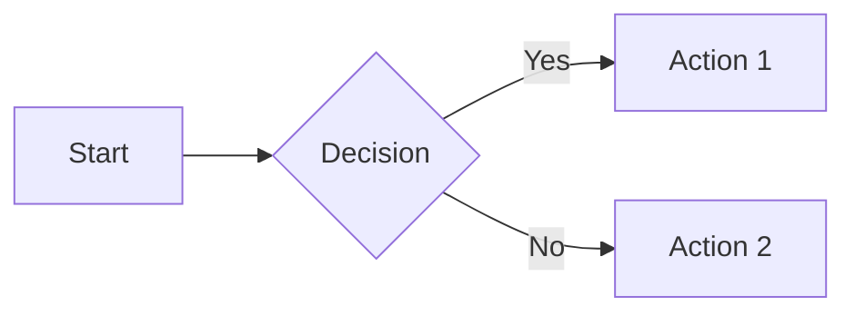
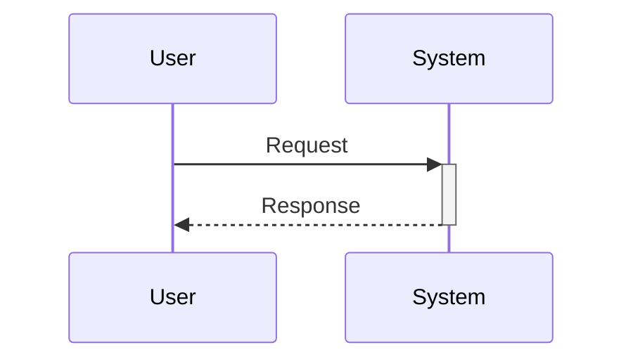
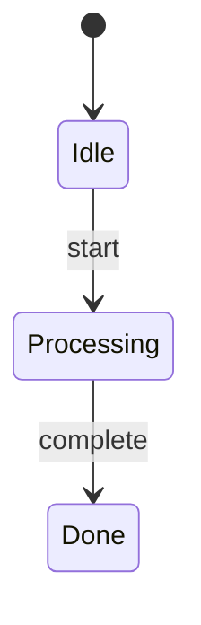
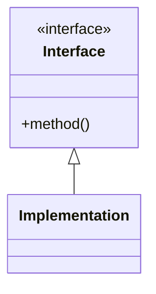
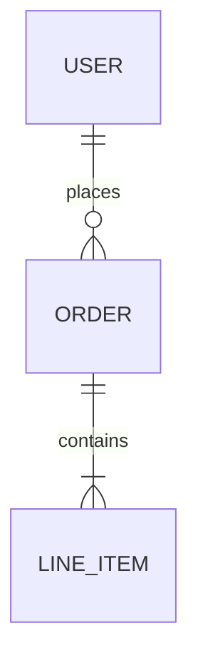

# Update Festina Lente Task Documentation

<purpose>
Update product documentation, commit the changes, push to remote, and move task from Update Docs to PR.
</purpose>

<context>
<note>
- **`.opencode/skills/festina-*/`** — Installed kanban skills — READ ONLY
- **`.festinalente/`** — Project data and config — READ/WRITE
- **`.festinalente/tasks/{id}/`** — Task folder containing `task.xml`, `spec.xml`, `plan.xml`
- **`.festinalente/quick/{id}/`** — Quick task folder containing `quick.xml` (for /festina-quick)
- **`.festinalente/scripts/`** — Helper scripts for kanban operations
- **`.festinalente/templates/`** — Document templates
- **`.festinalente/workflow.yaml`** — Workflow config (columns, labels, transitions)
- **`.festinalente/directives/`** — User-defined directives (custom instructions for skills)
</note>

<note>Use these scripts to reliably find files:</note>

<command description="Find task by ID (returns JSON with path and metadata)">node .festinalente/scripts/find-task.cjs {id}</command>


<command description="Get current date/time (returns JSON with iso and date formats)">node .festinalente/scripts/get-date-time.cjs</command>


<note>Use these scripts to work with product documentation:</note>


<command description="Search product docs by keywords (returns JSON sorted by relevance)">node .festinalente/scripts/search-product.cjs keyword1 keyword2 ...</command>
<command description="With minimum score threshold">node .festinalente/scripts/search-product.cjs password reset --min-score=0.3</command>
<note>Score interpretation: ≥0.5 = strong match | 0.3-0.5 = possible match | &lt;0.3 = weak match | No results = likely new feature</note>

<command description="Check if product docs exist by ID">node .festinalente/scripts/check-product.cjs auth/login auth/mfa billing/invoices</command>

<note>Path rule: ID `auth/login` → Path `.festinalente/product/auth/login.md`</note>

<note>Use these scripts to work with engineering documentation:</note>


<command description="Search engineering docs by keywords (returns JSON sorted by relevance)">node .festinalente/scripts/search-engineering.cjs keyword1 keyword2 ...</command>
<command description="With minimum score threshold">node .festinalente/scripts/search-engineering.cjs middleware pattern --min-score=0.3</command>
<note>Score interpretation: ≥0.5 = strong match | 0.3-0.5 = possible match | &lt;0.3 = weak match | No results = likely new pattern/system</note>

<command description="Check if engineering docs exist by ID">node .festinalente/scripts/check-engineering.cjs systems/auth patterns/middleware</command>

<note>Path rules:
- `overview` → `.festinalente/engineering/overview.md`
- `systems/auth` → `.festinalente/engineering/systems/auth/_index.md`
- `systems/auth/validator` → `.festinalente/engineering/systems/auth/validator.md`
- `patterns/acyclic-arch` → `.festinalente/engineering/patterns/acyclic-arch.md`
- `conventions/file-naming` → `.festinalente/engineering/conventions/file-naming.md`
</note>

<note>**`.festinalente/product/`** — Product documentation files organized by domain (e.g., `auth/login.md`, `overview.md`) — This is where user-facing docs live</note>

<note>**`.festinalente/engineering/`** — Engineering documentation files (systems, patterns, conventions)</note>

<note>**Diagram Guidelines:**</note>

<note>**When to include Mermaid diagrams:**</note>
- Workflows with 3+ steps or branching logic → `flowchart`
- User/system interactions → `sequenceDiagram`
- State transitions → `stateDiagram-v2`
- System architecture with 3+ components → `flowchart`
- Pattern relationships → `classDiagram`
- Database/data models → `erDiagram`

<note>**When to include ASCII mockups:**</note>
- UI elements (dialogs, forms, panels)
- Tree structures (file trees, hierarchies)
- Sidebar/panel layouts

<note>**Mermaid Syntax Quick Reference:**</note>

<example_code lang="markdown">
## Flowchart


## Sequence Diagram


## State Diagram


## Class Diagram


## Entity Relationship Diagram

</example_code>

<note>**ASCII Conventions:**</note>

<example_code lang="text">
## Window/Dialog
┌─────────────────────────────────┐
│  Title                    [X]  │
├─────────────────────────────────┤
│  Content                        │
│      [ Cancel ]  [ OK ]         │
└─────────────────────────────────┘

## Form Elements
Label:     [________________]     ← Text input
Dropdown:  [Option v]             ← Select
Radio:     (*) Selected  ( ) Not  ← Radio
Checkbox:  [x] Checked  [ ] Not   ← Checkbox
Button:    [ Submit ]             ← Button

## Tree View
├── Parent
│   ├── Child 1
│   └── Child 2
└── Sibling

## Sidebar
HEADER                    [+] [↻]
├── ▼ Expanded (2)
│   ├── Item 1
│   └── Item 2
└── ▶ Collapsed (3)
</example_code>

<note>**Smart Context:** `node .festinalente/scripts/select-context.cjs {taskId} --tier=standard` — Load similar docs for reference</note>

<note>**Quality Check:** `node .festinalente/scripts/validate-docs.cjs {path}` — Validate doc meets quality standards</note>

<note>**Glossary:** `.festinalente/glossary.yaml` — Project terminology (update when introducing new terms)</note>

<note>Column transition: update-docs → pr</note>
<note>See `.festinalente/workflow.yaml` for column definitions and valid transitions</note>
</context>

<prohibited>
- Do not use invented commit types like `kanban(...)` — valid types are: `docs`
- Do not update docs for features NOT touched by this task
- Do not mark unrelated features as "Planned" or "Not yet implemented"
- Do not add strikethroughs to features not touched by this task
- Do not skip pushing to remote
</prohibited>

<process>
  <step name="load_workflow">
    <action>Read `.festinalente/workflow.yaml` for column definitions, labels, priorities, and commit formats</action>
    <note>Use these values throughout this skill</note>
  </step>

  <step name="get_task_id" outputs="taskId">
    <branch condition="$ARGUMENTS provided">
      <action>Use $ARGUMENTS as taskId</action>
    </branch>
    <branch condition="$ARGUMENTS not provided">
      <action>List tasks in `update-docs` status from `.festinalente/tasks/`</action>
      <action>Use AskUserQuestion tool with:
        - header: "Task"
        - question: "Which task needs documentation?"
        - options: Build from task list (up to 4 tasks in update-docs status), each with:
          - label: "{taskId}: {short title}" (truncate title if needed)
          - description: "Status: update-docs | Ready for documentation"
        - multiSelect: false
      </action>
      <note>User can select "Other" to type a task ID directly</note>
    </branch>
  </step>

  <step name="read_task_file" outputs="taskPath, title, labels, affects">
    <command>node .festinalente/scripts/find-task.cjs {taskId}</command>
    <action>Read the file at the `path` from JSON output</action>
    <action>Parse XML</action>
    <validate>Verify current status is `update-docs`</validate>
    <branch condition="status is check">
      <output>Suggest `/festina-check {taskId}` first</output>
      <action>Exit</action>
    </branch>
    <branch condition="status is earlier">
      <output>Suggest appropriate command</output>
      <action>Exit</action>
    </branch>
    <action>Note title, labels, description for documentation context</action>
    <branch condition="task not found">
      <output>Error: Task not found</output>
      <action>Exit</action>
    </branch>
  </step>

  <step name="verify_branch">
    <command>git branch --show-current</command>
    <validate>Must be on branch `task/{id}` where {id} is the task ID</validate>
    <branch condition="not on expected branch">
      <output>Error: This command must be run on branch task/{id}. Current branch: {branch}</output>
      <output>Suggest: Switch to task branch with `git checkout task/{id}`</output>
      <action>Exit</action>
    </branch>
  </step>

  <step name="load_directives">
    <command>node .festinalente/scripts/get-skill-config.cjs festina-docs</command>
    <action>Parse the JSON output</action>
    
    <branch condition="directives.length > 0">
      <warning>Directives are MANDATORY. You MUST follow them.</warning>
      <action>For EACH directive where `exists` is `true`:</action>
      <action>Read the directive XML file at `path`</action>
      <action>Parse and apply:</action>
      <action>- `<context>` principles: Maintain as ongoing mindset</action>
      <action>- `<process>` rules where phase="docs": Follow as requirements</action>
      <action>- `<verification>` commands: Note for use in task `<verify>` elements</action>
      <note>`<validation>` checks will run in directive_compliance step</note>
      <note>`<examples>` will be shown if violations are found</note>
    </branch>
    
    <example_code lang="json">
    {
      "skill": "festina-docs",
      "directives": [
        { "name": "architecture", "path": ".festinalente/directives/architecture.xml", "exists": true }
      ]
    }
    </example_code>
  </step>

  <step name="analyze_product_doc_impact" outputs="stubDocs, existingDocs, missingDocs">
    <note>a. **Check affects field:**</note>
    <action>Read task's `affects` element from XML</action>
    <branch condition="affects has IDs">
      <command>node .festinalente/scripts/check-product.cjs {affects IDs}</command>
    </branch>

    <note>b. **Categorize docs:**</note>
    <action>For each doc ID in affects:</action>
    <action>- Read the doc file if it exists</action>
    <action>- Check for `stub: true` in frontmatter</action>
    <action>Categorize into: stubDocs (need completing), existingDocs (need updating), missingDocs (need creating)</action>

    <note>c. **Analyze task for unlisted impacts:**</note>
    <action>Read task description, spec, and implementation context</action>
    <command>node .festinalente/scripts/search-product.cjs {keywords from title/description}</command>
    <branch condition="high-scoring docs NOT in affects">
      <output>Suggest adding to affects</output>
    </branch>

    <note>d. **Present analysis to user:**</note>
    <output>Product Doc Analysis for Task {taskId}:</output>
    <output>Will COMPLETE (stub exists): {id} - stub created during /festina-create</output>
    <output>Will UPDATE (doc exists): {id} - {summary}</output>
    <output>Will CREATE (new doc needed): {id}</output>
    <output>Unaffected (internal change): {reason if applicable}</output>
    <action>Use AskUserQuestion tool with:
      - header: "Product docs"
      - question: "Proceed with product documentation updates?"
      - options:
        - label: "Yes (Recommended)", description: "Update/create product docs as analyzed"
        - label: "No", description: "Skip product documentation updates"
      - multiSelect: false
    </action>
  </step>

  <step name="analyze_engineering_doc_impact" outputs="engStubDocs, engExistingDocs, engMissingDocs">
    <note>a. **Check engineering field:**</note>
    <action>Read task's `engineering` element from XML</action>
    <branch condition="engineering has IDs">
      <command>node .festinalente/scripts/check-engineering.cjs {engineering IDs}</command>
    </branch>

    <note>b. **Categorize docs:**</note>
    <action>For each doc ID in engineering:</action>
    <action>- Read the doc file if it exists</action>
    <action>- Check for `stub: true` in frontmatter</action>
    <action>Categorize into: engStubDocs (need completing), engExistingDocs (need updating), engMissingDocs (need creating)</action>

    <note>c. **Analyze task for unlisted impacts:**</note>
    <action>Read task description, spec, and implementation context</action>
    <command>node .festinalente/scripts/search-engineering.cjs {technical keywords}</command>
    <branch condition="high-scoring docs NOT in engineering">
      <output>Suggest adding to engineering</output>
    </branch>

    <note>d. **Present analysis to user:**</note>
    <output>Engineering Doc Analysis for Task {taskId}:</output>
    <output>Will COMPLETE (stub exists): {id} - stub created during /festina-create</output>
    <output>Will UPDATE (doc exists): {id} - {summary}</output>
    <output>Will CREATE (new doc needed): {id}</output>
    <output>Unaffected (internal change): {reason if applicable}</output>
    <action>Use AskUserQuestion tool with:
      - header: "Eng docs"
      - question: "Proceed with engineering documentation updates?"
      - options:
        - label: "Yes (Recommended)", description: "Update/create engineering docs as analyzed"
        - label: "No", description: "Skip engineering documentation updates"
      - multiSelect: false
    </action>
  </step>

  <step name="load_smart_context" when="creating or completing product OR engineering docs">
    <note>**Load similar docs for reference on quality/structure**</note>
    <branch condition="product docs being created/completed">
      <command>node .festinalente/scripts/select-context.cjs {taskId} --tier=standard --max=3 --type=product</command>
      <action>Note product doc structure patterns</action>
    </branch>
    <branch condition="engineering docs being created/completed">
      <command>node .festinalente/scripts/select-context.cjs {taskId} --tier=standard --max=3 --type=engineering</command>
      <action>Note engineering doc structure patterns</action>
    </branch>
    <action>Parse JSON output</action>
    <action>For each doc in output, note the structure and quality patterns</action>
    <note>Use these as reference when writing new docs - match their level of detail</note>
  </step>

  <step name="update_existing_docs" when="docs need updating">
    <action>Read current doc at `.festinalente/product/{id}.md`</action>
    <action>Identify sections that need changes based on implementation</action>
    <action>Make minimal, focused updates (don't rewrite entire doc)</action>
    <action>Preserve existing content that's still accurate</action>
    <warning>SCOPE RESTRICTION: Only update docs to reflect what THIS task implemented</warning>

    <note>**Verification Prompt:**</note>
    <action>Read implemented code for this task</action>
    <action>Compare to doc content</action>
    <action>Use AskUserQuestion tool with:
      - header: "Verify"
      - question: "Does this doc accurately reflect the implementation?"
      - options:
        - label: "Yes", description: "Doc is accurate, no changes needed"
        - label: "Needs correction", description: "Some parts need to be fixed"
      - multiSelect: false
    </action>
    <branch condition="user selects Yes">
      <command description="Get current date">node .festinalente/scripts/get-date-time.cjs</command>
      <action>Update `verified: {YYYY-MM-DD}` in frontmatter</action>
      <action>Update `code_refs` with files touched by this task</action>
    </branch>
    <branch condition="user selects Needs correction">
      <action>Use AskUserQuestion tool with:
        - header: "Corrections"
        - question: "What needs to be corrected?"
        - options:
          - label: "Skip", description: "I'll describe the corrections"
        - multiSelect: false
      </action>
      <note>User can select "Other" to describe what needs correction</note>
      <action>Make corrections</action>
      <action>Re-verify with user</action>
      <action>Update `verified: {YYYY-MM-DD}` in frontmatter</action>
    </branch>

    <note>**Diagram Updates:**</note>
    <action>If implementation changed architecture → Update Architecture diagram</action>
    <action>If data flow changed → Update Data Flow diagram</action>
    <action>If UI changed → Update ASCII mockup</action>
    <action>If new relationships added → Update relationship diagrams</action>
  </step>

  <step name="complete_stub_docs" when="stub docs exist">
    <note>**Complete stub docs created during /festina-create**</note>
    <action>Read the stub doc</action>
    <action>Remove `stub: true` and `task:` from frontmatter</action>
    <command description="Get current date">node .festinalente/scripts/get-date-time.cjs</command>

    <note>**Required frontmatter fields:**</note>
    <action>Fill `tldr:` - Single sentence, max 100 chars, explains core purpose</action>
    <action>Fill `summary:` - One sentence for LLM discovery</action>
    <action>Fill `keywords:` - 3-5 terms users might search for</action>
    <action>Fill `aliases:` - Alternative names (e.g., "dark mode" → ["night mode", "theme toggle"])</action>
    <action>Fill `boundary:` - What this feature does NOT cover</action>
    <action>Update `updated:` with current date</action>
    <action>Add `verified:` with current date</action>
    <action>Add `code_refs:` with files touched by this task</action>

    <note>**Required content sections:**</note>
    <action>TL;DR blockquote at top (repeat tldr)</action>
    <action>Overview section with summary at end</action>
    <action>How It Works section with key workflows</action>
    <action>Examples section with code snippets from implementation</action>
    <action>Boundaries section listing what it does NOT do</action>

    <note>**Diagram Completion:**</note>
    <action>Analyze implemented code to generate appropriate diagrams:</action>
    <action>- Review code flow for sequence/flowchart diagrams</action>
    <action>- Check for UI components to create ASCII mockups</action>
    <action>- Trace data flow for data flow diagrams</action>
    <action>- If database models exist, create erDiagram</action>

    <action>Write content based on what was actually implemented</action>
    <action>Reference actual code paths where relevant</action>
  </step>

  <step name="complete_stub_engineering_docs" when="engineering stub docs exist">
    <note>**Complete stub docs created during /festina-create**</note>
    <action>Read the stub doc</action>
    <action>Remove `stub: true` and `task:` from frontmatter</action>
    <command description="Get current date">node .festinalente/scripts/get-date-time.cjs</command>

    <note>**Required frontmatter fields:**</note>
    <action>Fill `tldr:` - Single sentence, max 100 chars, explains core purpose</action>
    <action>Fill `summary:` - One sentence for LLM discovery</action>
    <action>Fill `keywords:` - 3-5 technical terms</action>
    <action>Fill `aliases:` - Alternative names for this system/pattern/convention</action>
    <action>Fill `boundary:` - What this does NOT cover</action>
    <action>Update `updated:` with current date</action>
    <action>Add `verified:` with current date</action>
    <action>Add `code_refs:` with files touched by this task</action>

    <note>**Required content sections (varies by type):**</note>
    <action>TL;DR blockquote at top</action>
    <action>Overview section with summary</action>

    <branch condition="type is system">
      <action>Architecture section - high-level design</action>
      <action>Components section - key parts and responsibilities</action>
      <action>Data Flow section - how data moves through system</action>
      <action>Integration section - how to use from other code</action>
    </branch>

    <branch condition="type is pattern">
      <action>Problem section - what problem this solves</action>
      <action>Solution section - the pattern approach</action>
      <action>When to Use section - applicable scenarios</action>
      <action>Implementation section - how to implement</action>
      <action>Examples section - code examples from this task</action>
    </branch>

    <branch condition="type is convention">
      <action>Rule section - the convention stated clearly</action>
      <action>Rationale section - why this convention exists</action>
      <action>Examples section - correct usage</action>
      <action>Exceptions section - when to deviate</action>
    </branch>

    <note>**Diagram Completion:**</note>
    <branch condition="type is system">
      <action>Generate Architecture diagram from component analysis</action>
      <action>Generate Data Flow diagram from code trace</action>
    </branch>
    <branch condition="type is pattern">
      <action>Generate Structure diagram showing pattern relationships (classDiagram)</action>
    </branch>
    <branch condition="type is convention">
      <action>Generate ASCII diagrams showing correct vs incorrect if structure-related</action>
    </branch>

    <action>Boundaries section - what this does NOT cover</action>
    <action>Write content based on what was actually implemented</action>
    <action>Reference actual code paths where relevant</action>
  </step>

  <step name="create_new_docs" when="new docs needed (no stub exists)">
    <action>Create domain folder if doesn't exist: `.festinalente/product/{domain}/`</action>
    <command description="Get current date">node .festinalente/scripts/get-date-time.cjs</command>
    <action>Use `date` field from output</action>

    <note>**For features** (use `.festinalente/templates/product-feature.md`):</note>
    <action>Fill ALL frontmatter fields:</action>
    <action>- `id:` {domain}/{feature}</action>
    <action>- `type:` feature</action>
    <action>- `title:` Human-readable title</action>
    <action>- `tldr:` Single sentence, max 100 chars</action>
    <action>- `summary:` One sentence for LLM discovery</action>
    <action>- `keywords:` 3-5 search terms</action>
    <action>- `aliases:` Alternative names users might use</action>
    <action>- `boundary:` What this does NOT cover</action>
    <action>- `related:` IDs of related docs</action>
    <action>- `updated:` Current date</action>
    <action>- `verified:` Current date</action>
    <action>- `code_refs:` Files implementing this feature</action>
    <action>Fill sections: Overview (with summary), How It Works, Examples, Boundaries, Limitations</action>

    <note>**For concepts** (use `.festinalente/templates/product-concept.md`):</note>
    <action>Same frontmatter fields as features</action>
    <action>Fill sections: Definition, Examples, Rules & Constraints, Boundaries</action>

    <action>Write content based on what was implemented</action>
    <action>Keep scope focused on THIS feature/concept only</action>
  </step>

  <step name="handle_internal_changes" when="no user-facing changes">
    <branch condition="affects is empty AND task labels include [bug, refactor, chore]">
      <action>Analyze if any product behavior actually changed</action>
      <branch condition="no user-facing changes">
        <output>No product doc updates needed - internal change</output>
        <action>Log reason and proceed without doc changes</action>
      </branch>
    </branch>
    <note>Use generic commit message: "docs({taskId}): product - no updates needed for {title}"</note>
  </step>

  <step name="update_engineering_docs" when="engineering docs need updating">
    <action>Read current doc (use ID→path rules from check-engineering)</action>
    <action>Identify sections that need changes based on implementation</action>
    <action>Make minimal, focused updates</action>
    <warning>SCOPE RESTRICTION: Only update docs to reflect what THIS task implemented</warning>
  </step>

  <step name="create_new_engineering_docs" when="new engineering docs needed (no stub exists)">
    <action>Determine doc type based on what was implemented:</action>
    <action>- **system**: New subsystem/service (e.g., auth system, cache layer)</action>
    <action>- **pattern**: Recurring solution (e.g., error handling, state management)</action>
    <action>- **convention**: Team standard (e.g., naming, file structure)</action>

    <action>Use AskUserQuestion to confirm type if unclear</action>
    <action>Create folder if needed: `.festinalente/engineering/{type}s/`</action>
    <command description="Get current date">node .festinalente/scripts/get-date-time.cjs</command>

    <note>**For systems** (use `.festinalente/templates/engineering-system.md`):</note>
    <action>Fill ALL frontmatter fields:</action>
    <action>- `id:` {type}s/{name}</action>
    <action>- `type:` system</action>
    <action>- `title:` Human-readable title</action>
    <action>- `tldr:` Single sentence, max 100 chars</action>
    <action>- `summary:` One sentence for LLM discovery</action>
    <action>- `keywords:` 3-5 technical terms</action>
    <action>- `aliases:` Alternative names</action>
    <action>- `boundary:` What this does NOT cover</action>
    <action>- `related:` IDs of related docs</action>
    <action>- `updated:` Current date</action>
    <action>- `verified:` Current date</action>
    <action>- `code_refs:` Files implementing this system</action>
    <action>Fill sections: Overview, Architecture, Components, Data Flow, Integration, Boundaries</action>

    <note>**For patterns** (use `.festinalente/templates/engineering-pattern.md`):</note>
    <action>Same frontmatter fields</action>
    <action>Fill sections: Problem, Solution, When to Use, Implementation, Examples, Boundaries</action>

    <note>**For conventions** (use `.festinalente/templates/engineering-convention.md`):</note>
    <action>Same frontmatter fields</action>
    <action>Fill sections: Rule, Rationale, Examples, Exceptions, Boundaries</action>

    <action>Write content based on what was implemented</action>
    <action>Keep scope focused on THIS system/pattern/convention only</action>
  </step>

  <step name="update_domain_index" when="new doc created in a domain">
    <note>**Update the domain's _index.md to include the new doc**</note>
    <action>Check if `.festinalente/product/{domain}/_index.md` exists</action>
    <branch condition="_index.md exists">
      <action>Read the _index.md file</action>
      <action>Add the new doc to the appropriate section (features list, concepts list)</action>
      <action>Add a one-line description matching the doc's tldr</action>
    </branch>
    <branch condition="_index.md doesn't exist">
      <note>Consider creating one if multiple docs now exist in this domain</note>
    </branch>
  </step>

  <step name="update_engineering_index" when="new engineering doc created in a type folder">
    <note>**Update the type's _index.md to include the new doc**</note>
    <action>Check if `.festinalente/engineering/{type}s/_index.md` exists</action>
    <branch condition="_index.md exists">
      <action>Read the _index.md file</action>
      <action>Add the new doc to the appropriate section</action>
      <action>Add a one-line description matching the doc's tldr</action>
    </branch>
    <branch condition="_index.md doesn't exist">
      <note>Consider creating one if multiple docs now exist in this type folder</note>
    </branch>
  </step>

  <step name="update_glossary" when="new terms introduced">
    <note>**Add new terminology to glossary**</note>
    <action>Identify any new terms introduced by this feature</action>
    <action>Check if terms exist in `.festinalente/glossary.yaml`</action>
    <branch condition="new terms found">
      <action>Read `.festinalente/glossary.yaml`</action>
      <action>Add new entries with:</action>
      <action>- term: The canonical name</action>
      <action>- aliases: Alternative names/spellings</action>
      <action>- definition: Brief explanation</action>
      <action>Write updated glossary</action>
      <output>Added to glossary: {terms}</output>
    </branch>
    <example_code lang="yaml">
# Example glossary entry:
- term: "Yolo mode"
  aliases: ["skip permissions", "dangerous mode", "auto-approve"]
  definition: "Mode that auto-approves all permission requests"
    </example_code>
  </step>

  <step name="validate_docs" when="docs were created or updated">
    <note>**Run quality validation on changed docs**</note>
    <command>node .festinalente/scripts/validate-docs.cjs {changed doc paths}</command>
    <branch condition="validation passes">
      <output>Quality check passed</output>
    </branch>
    <branch condition="validation fails">
      <output>Quality issues found:</output>
      <output>{issues from validation}</output>
      <action>Fix the issues before proceeding</action>
      <action>Re-run validation</action>
    </branch>
  </step>

  <step name="move_to_pr">
    <action>Change `status: update-docs` to `status: pr`</action>
    <command description="Get current date">node .festinalente/scripts/get-date-time.cjs</command>
    <action>Add `updated: {YYYY-MM-DD}` from output</action>
    <action>Write updated task file</action>
  </step>

  <step name="commit_docs_and_task">
    <note>Format: `docs({taskId}): product+engineering - {description}` or `docs({taskId}): product - {description}` if no engineering changes</note>
    <note>The description summarizes what documentation was updated (e.g., "add authentication guide", "update API reference")</note>
    <warning>CRITICAL: Use EXACTLY this format. Do NOT invent commit types like `kanban(...)`. The commit type is `docs`, not `kanban`.</warning>
    <command>git add .festinalente/product/</command>
    <command>git add .festinalente/engineering/</command>
    <command>git add .festinalente/glossary.yaml</command>
    <command>git add .festinalente/tasks/{taskId}/task.xml</command>
    <branch condition="both product and engineering docs were changed">
      <command>git commit -m "docs({taskId}): product+engineering - {description of doc changes}"</command>
    </branch>
    <branch condition="only product docs were changed">
      <command>git commit -m "docs({taskId}): product - {description of doc changes}"</command>
    </branch>
    <branch condition="only engineering docs were changed">
      <command>git commit -m "docs({taskId}): engineering - {description of doc changes}"</command>
    </branch>
    <branch condition="no docs changed">
      <command>git commit -m "docs({taskId}): product - no updates needed"</command>
    </branch>
  </step>

  <step name="push_branch">
    <command>git push -u origin task/{taskId}</command>
    <output>Branch pushed to remote</output>
  </step>

  <step name="directive_compliance">
    <note>Verify compliance with all loaded directives</note>
  
    <action>For each directive loaded in load_directives step:</action>
    <action>Re-read the directive XML file</action>
  
    <action>Run each `<validation>` check:</action>
  
    <branch condition="check type=command">
      <command>{content of <run> element}</command>
      <validate>{content of <expect> element}</validate>
    </branch>
  
    <branch condition="check type=pattern">
      <action>For each file matching `files` glob that was modified:</action>
      <action>Check content against `<forbidden>` or `<required>` regex</action>
    </branch>
  
    <branch condition="check type=checklist">
      <action>Self-assess each `<item>` as Y/N</action>
    </branch>
  
    <branch condition="any check fails">
      <output>Directive violation: {check id} - {reason}</output>
      <action>Find `<example>` elements where ref matches failed check</action>
      <action>Show violation examples to illustrate the problem</action>
      <action>Show correct examples to illustrate the fix</action>
      <action>Use AskUserQuestion tool with:
        - header: "Violation"
        - question: "Directive check failed. How would you like to proceed?"
        - options:
          - label: "Fix now", description: "Address the violation before continuing"
          - label: "Continue anyway", description: "Acknowledge and proceed despite violation"
        - multiSelect: false
      </action>
    </branch>
  </step>

  <step name="output_result">
    <output>Print documentation status (updated/skipped)</output>
    <output>Print commit hash (if docs were committed)</output>
    <output>Print: "Branch pushed. Ready for PR creation."</output>
    <output>Print: "Task {taskId} moved to PR column."</output>
    <warning>REQUIRED OUTPUT - Print next steps EXACTLY like this:</warning>
    <example_code lang="text">
Create PR on GitHub, then run:
/clear
/festina-merge {taskId}
    </example_code>
    <warning>Do NOT skip this output. The user needs these commands to continue.</warning>
    <output>Also mention: "Or if PR needs changes: /festina-rework {taskId}"</output>
    ## Final Validation
    
    Before completing, validate all task XML:
    
    <command description="Validate XML in task files">node .festinalente/scripts/validate-xml.cjs {taskId}</command>
    
    If validation fails, fix the reported errors before completing.
    
    <output>[KANBAN_COMPLETE]</output>
  </step>
</process>

<success_criteria>
- Task file exists at `.festinalente/tasks/{taskId}/task.xml`
- Task XML has `status="pr"`
- If docs created/updated:
  - All frontmatter fields filled (tldr, summary, keywords, aliases, boundary)
  - TL;DR blockquote present at top
  - Examples section with code snippets
  - Boundaries section present
  - `verified` date set to current date
  - `code_refs` populated with touched files
  - `stub: true` removed if was stub doc
  - Domain _index.md updated if applicable
  - Glossary updated if new terms
  - validate-docs passes
- Branch has been pushed to remote
- Next steps shown to user
</success_criteria>

<example>
**Completing a stub doc (new feature):**

User: `/festina-docs 001`

```
Completing documentation for task 001 "Add Yolo mode toggle"...

Task: 001 - Add Yolo mode toggle
Labels: [feature]
Affects: gui/yolo-mode

Product Doc Analysis:
Will COMPLETE (stub exists): gui/yolo-mode - stub created during /festina-create

Loading context from similar docs...
Found: gui/terminal.md, gui/settings.md (using as reference)

Proceed with product documentation updates? [Yes (Recommended)]

Completing stub doc: .festinalente/product/gui/yolo-mode.md

Filling frontmatter:
- tldr: "Toggle to skip all permission prompts in Claude sessions"
- keywords: [yolo, permissions, skip, auto-approve, settings]
- aliases: [skip permissions, dangerous mode, auto-approve]
- boundary: "Does not affect Claude's internal safety checks"
- verified: 2026-02-20
- code_refs: [src/settings/settings.orchestrator.ts, electron/main/pty-service.ts]

Writing content sections:
- Overview with summary
- How It Works (settings panel → toggle → PTY flag)
- Examples (enabling, disabling, persistence)
- Boundaries (what it doesn't do)

Updating domain index: .festinalente/product/gui/_index.md
Added: yolo-mode - Toggle to skip permission prompts

Updating glossary: .festinalente/glossary.yaml
Added term: "Yolo mode" (aliases: skip permissions, dangerous mode)

Running quality validation...
Quality check passed

Commit: h8i9j0k docs(001): product - complete yolo-mode documentation

Pushing branch...
Branch pushed to remote.

Task 001 moved to PR column.

Create PR on GitHub, then run:
/clear
/festina-merge 001

Or if PR needs changes: /festina-rework 001
```

**Updating existing docs:**

User: `/festina-docs 002`

```
Completing documentation for task 002 "Fix login redirect bug"...

Task: 002 - Fix login redirect bug
Labels: [bug]
Affects: auth/login

Product Doc Analysis:
Will UPDATE (doc exists): auth/login - Authentication flow documentation

Proceed with product documentation updates? [Yes (Recommended)]

Updating: .festinalente/product/auth/login.md
- Added redirect preservation to "How It Works" section
- Added example for deep link authentication
- Updated verified: 2026-02-20
- Updated code_refs with touched files

Running quality validation...
Quality check passed

Commit: a1b2c3d docs(002): product - update login redirect behavior

Task 002 moved to PR column.

Create PR on GitHub, then run:
/clear
/festina-merge 002
```

**Completing engineering stub doc (with product stub):**

User: `/festina-docs 004`

```
Completing documentation for task 004 "Add caching layer for API responses"...

Task: 004 - Add caching layer for API responses
Labels: [feature]
Affects: performance/api-caching
Engineering: systems/api-cache

Product Doc Analysis:
Will COMPLETE (stub exists): performance/api-caching - stub created during /festina-create

Proceed with product documentation updates? [Yes (Recommended)]

Engineering Doc Analysis:
Will COMPLETE (stub exists): systems/api-cache - stub created during /festina-create

Proceed with engineering documentation updates? [Yes (Recommended)]

Loading context from similar docs...
Found: systems/auth.md, systems/database.md (using as reference for engineering)
Found: performance/lazy-loading.md (using as reference for product)

Completing product stub doc: .festinalente/product/performance/api-caching.md
... (product doc completion) ...

Completing engineering stub doc: .festinalente/engineering/systems/api-cache.md

Filling frontmatter:
- tldr: "Redis-backed cache layer for external API responses"
- keywords: [cache, redis, api, performance, ttl]
- aliases: [api cache, response cache, redis cache]
- boundary: "Does not handle database query caching"
- verified: 2026-02-22
- code_refs: [src/cache/api-cache.ts, src/cache/redis-client.ts]

Writing content sections:
- Overview with summary
- Architecture (Redis connection, key strategy)
- Components (CacheManager, TTLPolicy, Invalidator)
- Data Flow (request → cache check → API call → store → response)
- Integration (how to wrap API calls)
- Boundaries (what it doesn't cache)

Updating type index: .festinalente/engineering/systems/_index.md
Added: api-cache - Redis-backed cache layer for external API responses

Running quality validation...
Quality check passed

Commit: d4e5f6g docs(004): product+engineering - add api caching documentation

Task 004 moved to PR column.

Create PR on GitHub, then run:
/clear
/festina-merge 004

Or if PR needs changes: /festina-rework 004
```

**Internal change (no docs needed):**

User: `/festina-docs 003`

```
Completing documentation for task 003 "Refactor database queries"...

Task: 003 - Refactor database queries
Labels: [refactor]
Affects: (empty)

Product Doc Analysis:
No user-facing changes detected (internal refactor)

Proceed with product documentation updates? [No]

Documentation skipped: Internal optimization

Task 003 moved to PR column.

Create PR on GitHub, then run:
/clear
/festina-merge 003
```
</example>

<note>
**Git History Example:**

Complete task lifecycle commits:
```
docs(001): create - Add user authentication
docs(001): refine - Add user authentication
docs(001): scope - Add user authentication
docs(001): plan - Add user authentication
wip(001): completed auth routes                    # optional, if interrupted
docs(001): verify-retry - Add user authentication  # optional, if verify failed
docs(001): rework - Add user authentication        # optional, if QA/PR failed
feat(001): Add user authentication                 # when QA passes
docs(001): product - add authentication guide      # docs step
# PR created and merged on GitHub
docs(001): done - Add user authentication          # after merge on main
```
</note>

<next_steps>
Create PR on GitHub, then merge:
```
/clear
/festina-merge {id}
```

Or if the PR needs changes:
```
/clear
/festina-rework {id}
```
</next_steps>
