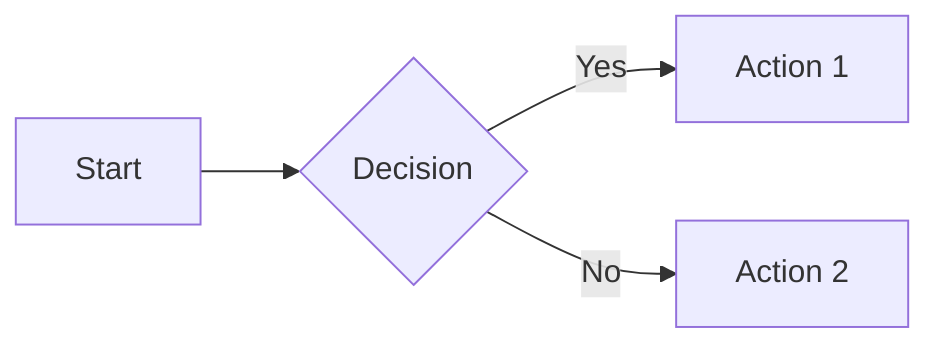
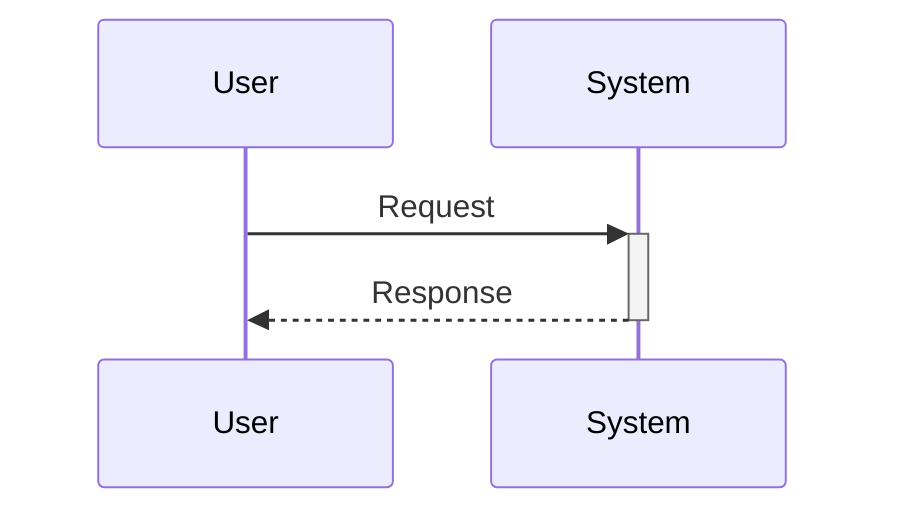
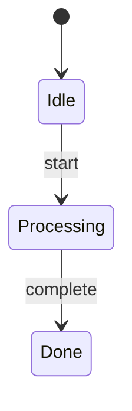
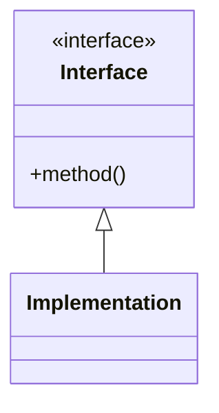
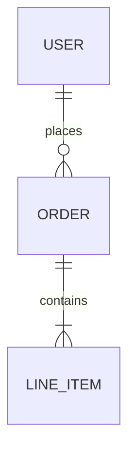
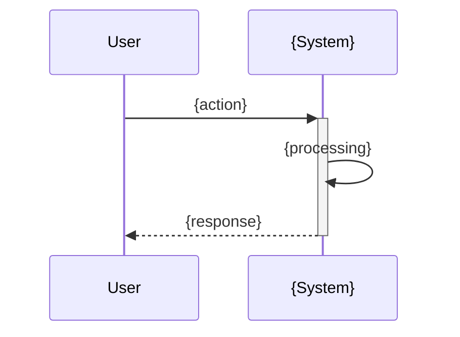

# Feature Plan: Mermaid + ASCII Diagram Support in Documentation

## Overview

Enhance Claude Kanban's documentation system to generate richer, more visual documentation using **Mermaid diagrams** and **ASCII art**.

**Scope:**
- Update documentation templates in `apps/kanban/src/content/templates/`
- Update skills in `apps/kanban/src/content/skills/`
- Create new partial in `apps/kanban/src/content/partials/`

**Key Principle:** Diagrams are included when they add clarity. Claude decides based on content analysis - no user prompts needed.

---

## System Context

### How Templates Work

Templates in `apps/kanban/src/content/templates/` are **placeholder examples** showing documentation structure. They use `{placeholder}` syntax (NOT Handlebars). When generating docs, Claude uses these templates as reference for structure and fills in actual content.

Example from `product-feature.md`:
```markdown
## How It Works

1. User {action}
2. System {response}
```

Claude replaces `{action}` with actual content when generating a doc.

### How Partials Work

Partials in `apps/kanban/src/content/partials/` are reusable content snippets included in skills via Handlebars syntax: `{{> partial-name}}`. The partial filename (without `.md`) becomes the include name.

Example: `{{> helper-scripts show_find_task=true}}` includes `helper-scripts.md` with conditional content.

### How Skills Work

Skills in `apps/kanban/src/content/skills/{skill-name}/SKILL.md` are XML-structured instructions that guide Claude through workflows. They include partials in their `<context>` section.

### Build Process

```bash
cd apps/kanban
pnpm build
```

This compiles:
1. TypeScript scripts → `dist/scripts/`
2. Handlebars templates (skills + partials) → `dist/content/`

To verify changes: Check for compilation errors and inspect `dist/content/skills/` output.

---

## Background

### Why Mermaid?

Mermaid is a JavaScript library that renders diagrams from text:
- **Claude generates it fluently** - No special training needed
- **Renders natively** in GitHub, GitLab, VS Code, Docusaurus, Notion, Obsidian
- **Version controlled** - It's just text in markdown
- **No build step required** - Platforms render automatically

### Why ASCII?

ASCII art works everywhere:
- UI mockups (windows, dialogs, forms, tree views)
- Quick inline visualizations
- Environments without Mermaid rendering

### When to Include Diagrams

| Content Type | Include Diagram When... | Diagram Type |
|--------------|------------------------|--------------|
| Workflow | 3+ steps or branching logic | Mermaid `flowchart` |
| User interaction | Back-and-forth between user/system | Mermaid `sequenceDiagram` |
| State transitions | Multiple states with transitions | Mermaid `stateDiagram-v2` |
| System architecture | 3+ components with relationships | Mermaid `flowchart` |
| Pattern structure | Abstract relationships to show | Mermaid `classDiagram` |
| Data models | Database entities and relationships | Mermaid `erDiagram` |
| UI element | Visual interface to describe | ASCII mockup |
| Tree/hierarchy | Nested structure to represent | ASCII tree |

---

## Files to Modify

### New Files

| File | Purpose |
|------|---------|
| `apps/kanban/src/content/partials/diagram-guidelines.md` | Shared partial with diagram syntax and decision criteria |

### Templates (`apps/kanban/src/content/templates/`)

| File | Change Type | Description |
|------|-------------|-------------|
| `product-feature.md` | Add sections | Add sequence diagram to "How It Works", flowchart to "Key Workflows", ASCII to new "User Interface" section |
| `product-concept.md` | Update existing | Update existing "Relationships" section (line 63) to use Mermaid |
| `product-domain.md` | Add section | Add "Domain Structure" diagram after "Overview" section |
| `product-overview.md` | Add section | Add "Product Architecture" diagram after "Key Capabilities" section |
| `engineering-system.md` | Update + Add | Add "Architecture" section with Mermaid, update "Data Flow" (line 43) to use Mermaid |
| `engineering-pattern.md` | Add section | Add "Structure" section with classDiagram after "Solution" section |
| `engineering-convention.md` | Update existing | Enhance "Examples" section (line 31) with ASCII structure diagrams |
| `engineering-overview.md` | Add section | Add "System Architecture" diagram after "Architecture Summary" section |
| `engineering-component.md` | Add section | Add "Data Flow" diagram after "Overview" section |

### Skills (`apps/kanban/src/content/skills/`)

| Skill | Changes |
|-------|---------|
| `kanban-map-product/SKILL.md` | Add partial include, add diagram guidance in `socratic_qa_dialogue` step |
| `kanban-map-engineering/SKILL.md` | Add partial include, enhance Architecture Mapper agent, add diagram guidance |
| `kanban-docs/SKILL.md` | Add partial include, add diagram guidance in stub completion steps |

---

## Detailed Changes

### 1. Create Diagram Guidelines Partial

**File:** `apps/kanban/src/content/partials/diagram-guidelines.md`

**Full content:**
```markdown
<note>**Diagram Guidelines:**</note>

<note>**When to include Mermaid diagrams:**</note>
- Workflows with 3+ steps or branching logic → `flowchart`
- User/system interactions → `sequenceDiagram`
- State transitions → `stateDiagram-v2`
- System architecture with 3+ components → `flowchart`
- Pattern relationships → `classDiagram`
- Database/data models → `erDiagram`

<note>**When to include ASCII mockups:**</note>
- UI elements (dialogs, forms, panels)
- Tree structures (file trees, hierarchies)
- Sidebar/panel layouts

<note>**Mermaid Syntax Quick Reference:**</note>

<example_code lang="markdown">
## Flowchart


## Sequence Diagram


## State Diagram


## Class Diagram


## Entity Relationship Diagram

</example_code>

<note>**ASCII Conventions:**</note>

<example_code lang="text">
## Window/Dialog
┌─────────────────────────────────┐
│  Title                    [X]  │
├─────────────────────────────────┤
│  Content                        │
│      [ Cancel ]  [ OK ]         │
└─────────────────────────────────┘

## Form Elements
Label:     [________________]     ← Text input
Dropdown:  [Option v]             ← Select
Radio:     (*) Selected  ( ) Not  ← Radio
Checkbox:  [x] Checked  [ ] Not   ← Checkbox
Button:    [ Submit ]             ← Button

## Tree View
├── Parent
│   ├── Child 1
│   └── Child 2
└── Sibling

## Sidebar
HEADER                    [+] [↻]
├── ▼ Expanded (2)
│   ├── Item 1
│   └── Item 2
└── ▶ Collapsed (3)
</example_code>
```

---

### 2. Update `product-feature.md`

**File:** `apps/kanban/src/content/templates/product-feature.md`

**Change:** Replace lines 24-35 (the "How It Works" section) with:

```markdown
## How It Works



1. User {action}
2. System {response}
3. Result: {outcome}

### Key Workflows

**{Workflow Name}:**

```mermaid
flowchart LR
    A[{Step 1}] --> B[{Step 2}]
    B --> C[{Step 3}]
```

- {Step 1}
- {Step 2}
- {Step 3}

**Summary:** {Brief recap of the main workflow}

### User Interface

```
┌─────────────────────────────────┐
│  {Feature UI}             [X]  │
├─────────────────────────────────┤
│  {UI description}               │
│                                 │
│      [ {Action} ]               │
└─────────────────────────────────┘
```
```

---

### 3. Update `product-concept.md`

**File:** `apps/kanban/src/content/templates/product-concept.md`

**Change:** Replace lines 63-76 (the existing "Relationships" section) with:

```markdown
## Relationships

```mermaid
flowchart TB
    {Concept}[{Concept Name}]
    {Related1}[{Related Concept 1}]
    {Related2}[{Related Concept 2}]
    {Concept} --> {Related1}
    {Concept} --> {Related2}
```

- **{Related Concept}**: {Nature of relationship}
- **{Related Concept}**: {Nature of relationship}

## Edge Cases

- **{Scenario}**: {How this concept behaves in this edge case}
- **{Scenario}**: {How this concept behaves in this edge case}
```

---

### 4. Update `product-domain.md`

**File:** `apps/kanban/src/content/templates/product-domain.md`

**Change:** Insert after line 26 (after "Overview" section, before "Boundaries"):

```markdown
## Domain Structure

```mermaid
flowchart TB
    subgraph {Domain}
        {Feature1}[{Feature 1}]
        {Feature2}[{Feature 2}]
        {Feature3}[{Feature 3}]
    end
    {Feature1} --> {Feature2}
```

```

---

### 5. Update `product-overview.md`

**File:** `apps/kanban/src/content/templates/product-overview.md`

**Change:** Insert after line 29 (after "Key Capabilities" section, before "Target Users"):

```markdown
## Product Architecture

```mermaid
flowchart TB
    subgraph {Product Name}
        {Domain1}[{Domain 1}]
        {Domain2}[{Domain 2}]
        {Domain3}[{Domain 3}]
    end
    User --> {Domain1}
    {Domain1} --> {Domain2}
```

```

---

### 6. Update `engineering-system.md`

**File:** `apps/kanban/src/content/templates/engineering-system.md`

**Change:** Replace lines 43-47 (the "Data Flow" section) with:

```markdown
## Architecture

```mermaid
flowchart TB
    subgraph {System Name}
        {Component1}[{Component 1}]
        {Component2}[{Component 2}]
        {Component3}[{Component 3}]
    end
    Input --> {Component1}
    {Component1} --> {Component2}
    {Component2} --> {Component3}
    {Component3} --> Output
```

{Prose description of architecture}

## Data Flow

```mermaid
flowchart LR
    A[Input] --> B[{Processing Step 1}]
    B --> C[{Processing Step 2}]
    C --> D[Output]
```

{Prose description of data flow}
```

---

### 7. Update `engineering-pattern.md`

**File:** `apps/kanban/src/content/templates/engineering-pattern.md`

**Change:** Insert after line 29 (after "Solution" section, before "When to Use"):

```markdown
## Structure

```mermaid
classDiagram
    class {Interface} {
        <<interface>>
        +{method}()
    }
    class {Implementation} {
        +{method}()
    }
    {Interface} <|-- {Implementation}
    {Client} --> {Interface}
```

```

---

### 8. Update `engineering-convention.md`

**File:** `apps/kanban/src/content/templates/engineering-convention.md`

**Change:** Replace lines 31-46 (the "Examples" section) with:

```markdown
## Examples

### Correct

```
{ASCII representation of correct structure/naming}
```

```{language}
{good code example}
```

### Incorrect

```
{ASCII representation of incorrect structure/naming}
```

```{language}
{bad example}
// Violates: {which aspect of rule}
```

**Summary:** {Brief recap of examples}
```

---

### 9. Update `engineering-overview.md`

**File:** `apps/kanban/src/content/templates/engineering-overview.md`

**Change:** Insert after line 39 (after "Architecture Summary" section, before "Directory Structure"):

```markdown
## System Architecture

```mermaid
flowchart TB
    subgraph Systems
        {System1}[{System 1}]
        {System2}[{System 2}]
        {System3}[{System 3}]
    end
    External --> {System1}
    {System1} --> {System2}
    {System2} --> {System3}
```

```

---

### 10. Update `engineering-component.md`

**File:** `apps/kanban/src/content/templates/engineering-component.md`

**Change:** Insert after line 27 (after "Overview" section, before "Interface"):

```markdown
## Data Flow

```mermaid
flowchart LR
    Input --> {Component}
    {Component} --> Output
```

```

---

### 11. Update `kanban-map-product` Skill

**File:** `apps/kanban/src/content/skills/kanban-map-product/SKILL.md`

**Change 11.1:** Add partial include in `<context>` section (after line 17, after `{{> product-docs-scripts ...}}`):

```xml
{{> diagram-guidelines}}
```

**Change 11.2:** In the `socratic_qa_dialogue` step (around line 370, after the `</example_code>` for the feature template), add:

```xml
<note>**Diagram Generation:**</note>
<action>Analyze feature content to determine appropriate diagrams:</action>
<action>- If workflow has 3+ steps or branching → Add Mermaid flowchart</action>
<action>- If user/system interaction → Add Mermaid sequence diagram</action>
<action>- If UI element → Add ASCII mockup</action>
<action>- If data model → Add Mermaid erDiagram</action>
<action>Generate diagrams based on Q&A responses and code analysis</action>
```

---

### 12. Update `kanban-map-engineering` Skill

**File:** `apps/kanban/src/content/skills/kanban-map-engineering/SKILL.md`

**Change 12.1:** Add partial include in `<context>` section (after line 17, after `{{> engineering-docs-scripts ...}}`):

```xml
{{> diagram-guidelines}}
```

**Change 12.2:** In the `parallel_discovery` step, update the Architecture Mapper agent prompt (around line 82-99). Replace the existing `<prompt>` content with:

```xml
<prompt>
Map the system architecture of this codebase:
1. Identify major subsystems (auth, api, database, cache, etc.)
2. Find entry points for each system
3. Trace data flow between systems
4. Identify integration points (APIs, events, queues)
5. Find configuration and environment handling
6. Note any microservices or separate deployables

For each system, provide:
- name: System name
- purpose: What it does (1 sentence)
- entry_points: Main files/classes
- components: Key internal components (for Architecture diagram)
- interacts_with: Other systems it communicates with
- data_flow: How data moves through it (for Data Flow diagram)

Provide Mermaid-ready descriptions:
- System relationships (which systems connect to which)
- Data flow sequences (input → processing → output)
- Component hierarchy within each system
</prompt>
```

**Change 12.3:** After the system doc creation (around line 280, after the `</example_code>` for the system template), add:

```xml
<note>**Diagram Generation:**</note>
<action>For each system doc, generate:</action>
<action>- Architecture diagram showing components (Mermaid flowchart TB with subgraph)</action>
<action>- Data flow diagram (Mermaid flowchart LR)</action>
<action>For pattern docs, generate:</action>
<action>- Structure diagram showing relationships (Mermaid classDiagram)</action>
<action>For convention docs where structure matters, generate:</action>
<action>- ASCII diagrams showing correct vs incorrect structure</action>
```

---

### 13. Update `kanban-docs` Skill

**File:** `apps/kanban/src/content/skills/kanban-docs/SKILL.md`

**Change 13.1:** Add partial include in `<context>` section (after line 28, after the engineering docs note):

```xml
{{> diagram-guidelines}}
```

**Change 13.2:** In the `complete_stub_docs` step (around line 246, after the content sections list), add:

```xml
<note>**Diagram Completion:**</note>
<action>Analyze implemented code to generate appropriate diagrams:</action>
<action>- Review code flow for sequence/flowchart diagrams</action>
<action>- Check for UI components to create ASCII mockups</action>
<action>- Trace data flow for data flow diagrams</action>
<action>- If database models exist, create erDiagram</action>
```

**Change 13.3:** In the `complete_stub_engineering_docs` step (around line 293, after the branch conditions for type), add:

```xml
<note>**Diagram Completion:**</note>
<branch condition="type is system">
  <action>Generate Architecture diagram from component analysis</action>
  <action>Generate Data Flow diagram from code trace</action>
</branch>
<branch condition="type is pattern">
  <action>Generate Structure diagram showing pattern relationships (classDiagram)</action>
</branch>
<branch condition="type is convention">
  <action>Generate ASCII diagrams showing correct vs incorrect if structure-related</action>
</branch>
```

**Change 13.4:** In the `update_existing_docs` step (around line 219, after the verification prompt handling), add:

```xml
<note>**Diagram Updates:**</note>
<action>If implementation changed architecture → Update Architecture diagram</action>
<action>If data flow changed → Update Data Flow diagram</action>
<action>If UI changed → Update ASCII mockup</action>
<action>If new relationships added → Update relationship diagrams</action>
```

---

## Implementation Order

### Phase 1: Foundation
1. Create `apps/kanban/src/content/partials/diagram-guidelines.md`
2. Build and verify: `cd apps/kanban && pnpm build`
3. Check `dist/content/` for successful compilation

### Phase 2: Templates (in order of complexity)
4. Update `engineering-system.md` - Most impactful, has existing Data Flow section
5. Update `engineering-pattern.md`
6. Update `engineering-convention.md`
7. Update `engineering-overview.md`
8. Update `engineering-component.md`
9. Update `product-feature.md`
10. Update `product-concept.md`
11. Update `product-domain.md`
12. Update `product-overview.md`

### Phase 3: Skills
13. Update `kanban-map-engineering/SKILL.md`
14. Update `kanban-map-product/SKILL.md`
15. Update `kanban-docs/SKILL.md`

### Phase 4: Validation
16. Build: `cd apps/kanban && pnpm build`
17. Verify no compilation errors
18. Inspect `dist/content/skills/` to confirm partials expanded
19. Test a skill on sample content to verify diagram generation

---

## Success Criteria

1. `pnpm build` completes without errors
2. Templates include diagram sections as standard structure
3. Skills include `{{> diagram-guidelines}}` partial
4. Skills have diagram generation guidance in appropriate steps
5. Mermaid diagrams render correctly in GitHub markdown preview
6. ASCII mockups display correctly in monospace environments

---

## Decisions

| Question | Decision | Rationale |
|----------|----------|-----------|
| Mermaid syntax validation? | Skip for now | Claude generates valid syntax reliably; errors visible in PR preview |
| Diagram complexity limits? | Trust Claude's judgment | No hard limits; Claude will keep diagrams readable |
| Additional Mermaid types? | Add `erDiagram` | Useful for projects with data models; skip others (Gantt, pie, gitGraph) |
| User prompts for diagrams? | No - Claude decides | Based on content analysis; reduces friction |
| Template approach? | Standard structure with placeholders | Follow existing pattern; no conditionals |

---

## References

- [Mermaid Official Documentation](https://mermaid.js.org/)
- [Mermaid Live Editor](https://mermaid.live/)
- [ASCIIFlow Editor](https://asciiflow.com/)
- [CHI 2024: Taking ASCII Drawings Seriously](https://pg.ucsd.edu/publications/how-programmers-ASCII-diagram-code_CHI-2024.pdf)
