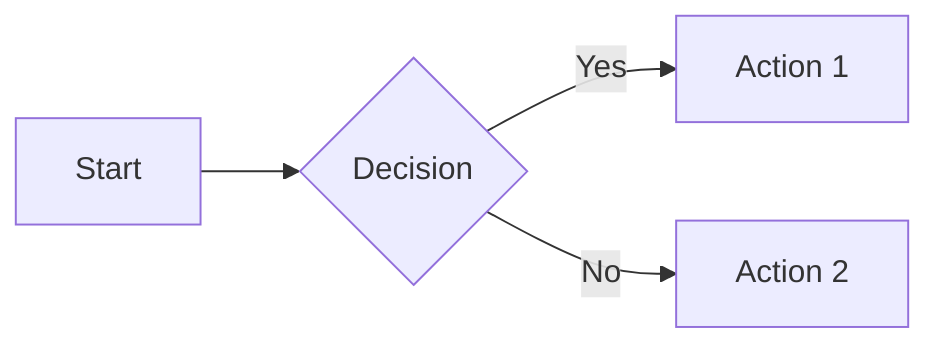
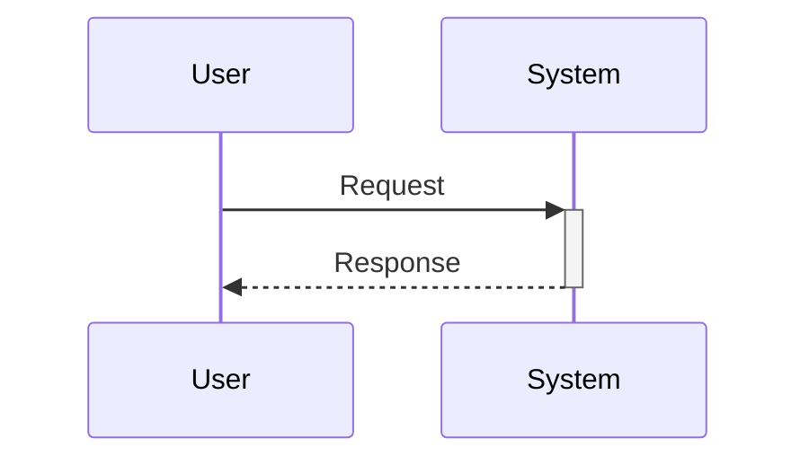
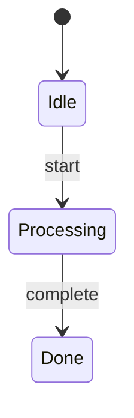
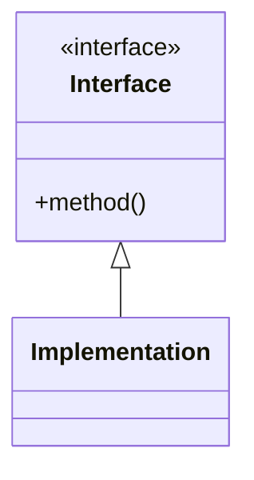
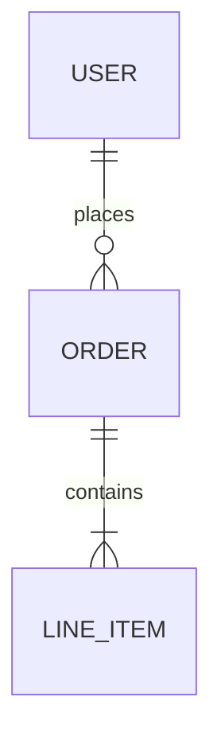

<note>**Diagram Guidelines:**</note>

<note>**When to include Mermaid diagrams:**</note>
- Workflows with 3+ steps or branching logic → `flowchart`
- User/system interactions → `sequenceDiagram`
- State transitions → `stateDiagram-v2`
- System architecture with 3+ components → `flowchart`
- Pattern relationships → `classDiagram`
- Database/data models → `erDiagram`

<note>**When to include ASCII mockups:**</note>
- UI elements (dialogs, forms, panels)
- Tree structures (file trees, hierarchies)
- Sidebar/panel layouts

<note>**Mermaid Syntax Quick Reference:**</note>

<example_code lang="markdown">
## Flowchart

## Sequence Diagram

## State Diagram

## Class Diagram

## Entity Relationship Diagram

</example_code>

<note>**ASCII Conventions:**</note>

<example_code lang="text">
## Window/Dialog
┌─────────────────────────────────┐
│  Title                    [X]  │
├─────────────────────────────────┤
│  Content                        │
│      [ Cancel ]  [ OK ]         │
└─────────────────────────────────┘

## Form Elements
Label:     [________________]     ← Text input
Dropdown:  [Option v]             ← Select
Radio:     (*) Selected  ( ) Not  ← Radio
Checkbox:  [x] Checked  [ ] Not   ← Checkbox
Button:    [ Submit ]             ← Button

## Tree View
├── Parent
│   ├── Child 1
│   └── Child 2
└── Sibling

## Sidebar
HEADER                    [+] [↻]
├── ▼ Expanded (2)
│   ├── Item 1
│   └── Item 2
└── ▶ Collapsed (3)
</example_code>
